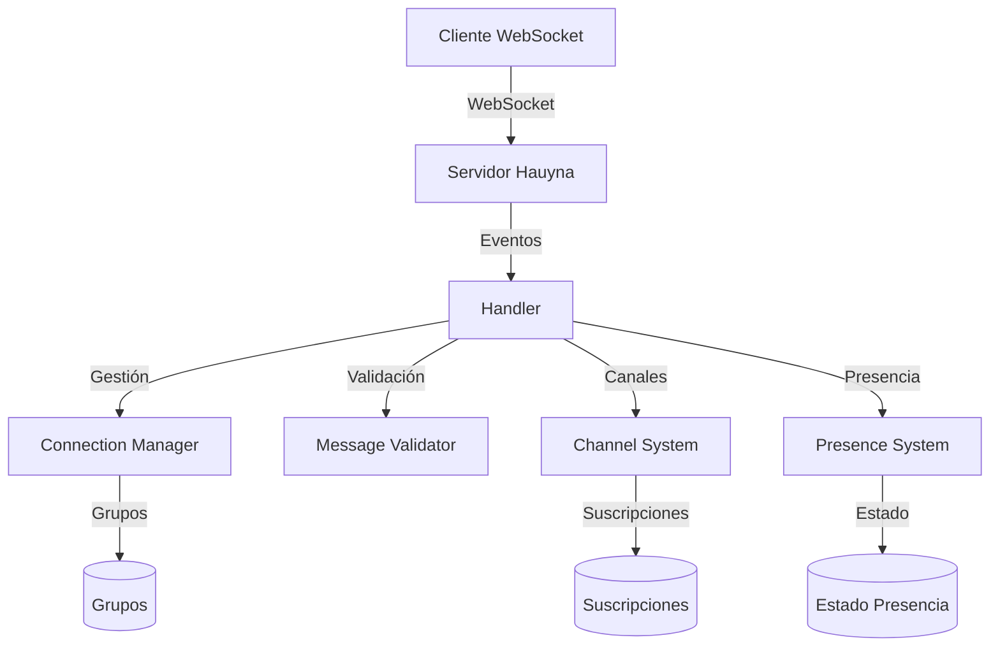
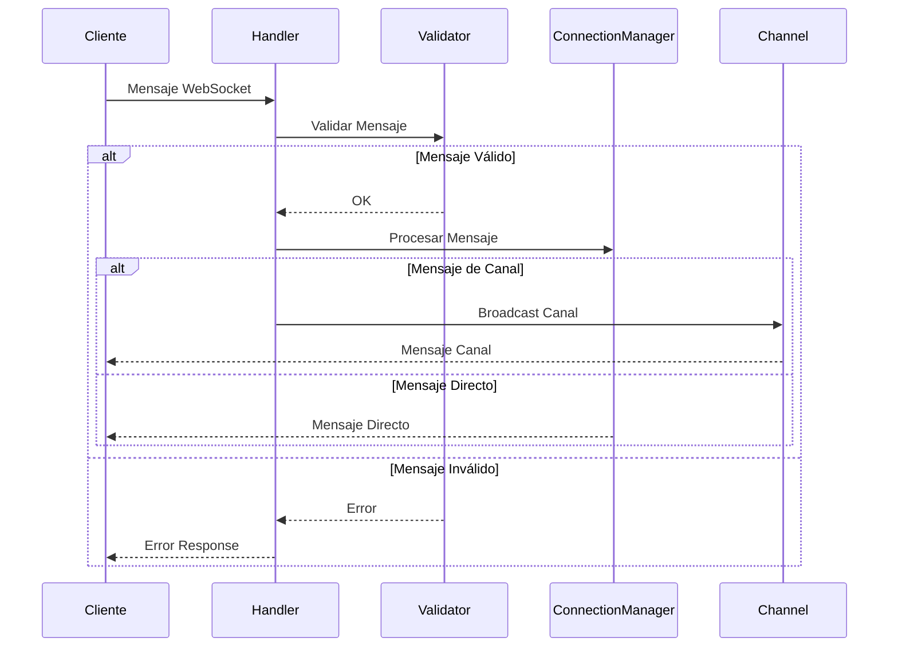
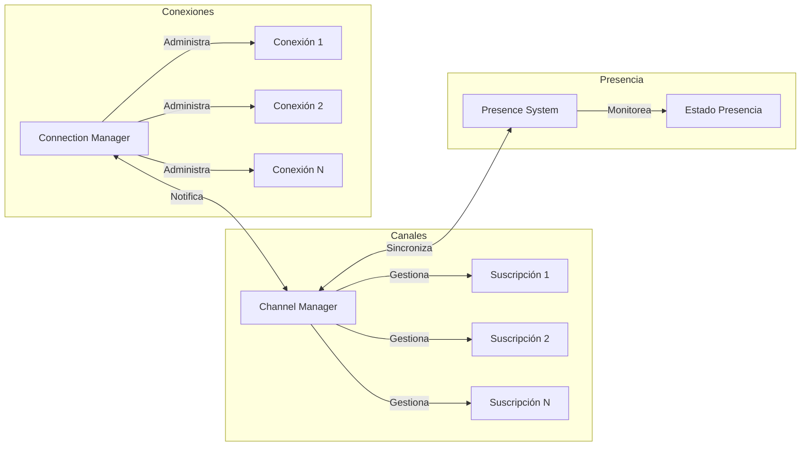
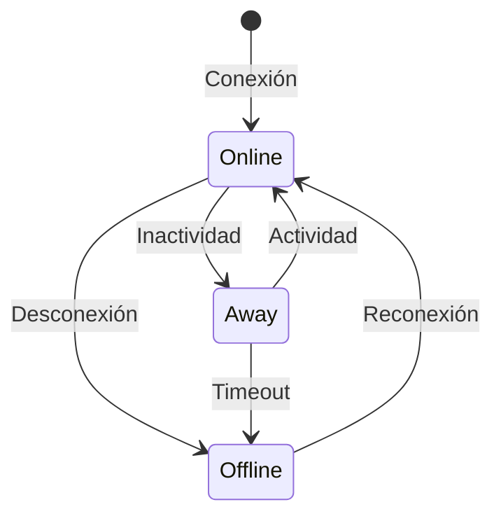

# Hauyna WebSocket

[](https://crystal-lang.org)
[](LICENSE)
[](https://github.com/hauyna/hauyna-web-socket/releases)
[](https://github.com/hauyna/hauyna-web-socket/actions)

**Hauyna WebSocket** es una biblioteca Crystal diseñada para simplificar la implementación de aplicaciones WebSocket en tiempo real. Proporciona un conjunto completo de herramientas para gestionar conexiones WebSocket, canales, grupos, seguimiento de presencia, manejo de eventos y más.


🚀 **Características Destacadas**:
- 📡 Sistema de canales para comunicación en tiempo real
- 👥 Gestión avanzada de grupos y conexiones
- 🔄 Eventos personalizables y sistema de presencia
- ❤️ Monitoreo de salud con heartbeat automático
- 🛡️ Manejo robusto de errores
- 🎯 Enrutamiento dinámico de WebSockets
- 🔍 Validación de mensajes
- 👀 Sistema de presencia en tiempo real
- 🔐 Gestión de sesiones y autenticación
- 🌐 Soporte para múltiples canales
- 📊 Metadatos personalizables
- 🔄 Reconexión automática
- 📨 Broadcast y mensajes directos
- 🎭 Roles y permisos por grupo

## Características Detalladas

### Sistema de Canales
- **Suscripciones Flexibles**: Suscribe sockets a múltiples canales con metadatos personalizados
- **Broadcast Selectivo**: Envía mensajes a canales específicos o grupos de usuarios
- **Gestión de Suscriptores**: Monitorea y administra suscriptores por canal
- **Eventos de Canal**: Notificaciones automáticas de suscripción/desuscripción
- **Metadatos por Canal**: Almacena información adicional por suscripción

### Sistema de Presencia
- **Estado en Tiempo Real**: Monitoreo del estado de usuarios (online/away/offline)
- **Metadatos de Usuario**: Almacena información personalizada por usuario
- **Filtrado por Contexto**: Busca usuarios por canal, grupo o criterios personalizados
- **Eventos de Presencia**: Notificaciones automáticas de cambios de estado
- **Estadísticas**: Conteo y análisis de usuarios presentes

### Gestión de Conexiones
- **Identificación Única**: Sistema de identificadores para conexiones
- **Agrupación**: Organiza usuarios en grupos para mensajes dirigidos
- **Mensajes Directos**: Envía mensajes a usuarios específicos
- **Broadcast**: Envía mensajes a todos los usuarios o grupos
- **Limpieza Automática**: Gestión de desconexiones y limpieza de recursos

### Sistema de Eventos
- **Eventos Personalizados**: Define y maneja eventos específicos de la aplicación
- **Callbacks**: Manejadores de eventos flexibles
- **Propagación**: Control sobre la propagación de eventos
- **Tipos de Eventos**: Soporte para eventos de sistema y usuario
- **Contexto**: Acceso al contexto completo en los manejadores

### Heartbeat y Monitoreo
- **Ping/Pong Automático**: Verificación periódica de conexiones
- **Timeouts Configurables**: Ajusta intervalos de verificación
- **Reconexión**: Manejo automático de reconexiones
- **Estado de Conexión**: Monitoreo del estado de la conexión
- **Limpieza**: Cierre automático de conexiones inactivas

### Manejo de Errores
- **Validación de Mensajes**: Verificación automática de formato y contenido
- **Errores Tipados**: Diferentes tipos de errores para mejor manejo
- **Respuestas de Error**: Formato consistente de mensajes de error
- **Recuperación**: Estrategias de recuperación de errores
- **Logging**: Registro detallado de errores

### Enrutamiento
- **Rutas Dinámicas**: Soporte para parámetros en URLs
- **Middleware**: Procesamiento previo de conexiones
- **Extracción de Parámetros**: Parse automático de query params
- **Validación**: Verificación de upgrade y conexión WebSocket
- **Manejo de Contexto**: Acceso al contexto HTTP completo

## Tabla de Contenidos

- [Características](#características)
- [Arquitectura](#arquitectura)
  - [Diagrama General](#diagrama-general)
  - [Flujo de Mensajes](#flujo-de-mensajes)
  - [Arquitectura de Canales](#arquitectura-de-canales)
  - [Sistema de Presencia](#sistema-de-presencia)
- [Instalación](#instalación)
- [Uso](#uso)
  - [Configurando el Enrutador](#configurando-el-enrutador)
  - [Creando un Manejador de WebSocket](#creando-un-manejador-de-websocket)
  - [Gestionando Canales](#gestionando-canales)
  - [Manejo de Eventos](#manejo-de-eventos)
  - [Gestionando Conexiones y Grupos](#gestionando-conexiones-y-grupos)
  - [Seguimiento de Presencia](#seguimiento-de-presencia)
  - [Manejo de Errores](#manejo-de-errores)
  - [Mecanismo de Heartbeat](#mecanismo-de-heartbeat)
- [Referencia de la API](#referencia-de-la-api)
- [Ejemplos](#ejemplos)
- [Ejemplos Prácticos](#ejemplos-prácticos)
- [Contribuciones](#contribuciones)
- [Autores](#autores)
- [Licencia](#licencia)

## Características

- **Gestión de Canales**: Organiza las comunicaciones por tópicos con un sistema de canales robusto.
- **Gestión de Conexiones**: Maneja conexiones WebSocket de manera eficiente, incluyendo la gestión de grupos.
- **Manejo de Eventos**: Registra y dispara eventos personalizados para una interactividad mejorada.
- **Seguimiento de Presencia**: Monitorea la presencia de usuarios en tiempo real con soporte de metadatos.
- **Mecanismo de Heartbeat**: Asegura la salud de las conexiones con comprobaciones automáticas de ping/pong.
- **Manejo de Errores**: Maneja y responde de forma elegante a diversos errores de WebSocket.
- **Enrutamiento**: Enruta conexiones WebSocket basadas en rutas URL con parámetros dinámicos.

## Arquitectura

### Diagrama General



### Flujo de Mensajes



### Arquitectura de Canales



### Sistema de Presencia



## Instalación

Añade la dependencia a tu `shard.yml`:

```yaml
dependencies:
  hauyna-web-socket:
    github: tuusuario/hauyna-web-socket
    version: ~> 1.0.0
```

Ejecuta `shards install` para instalar la shard.

## Uso

### Configurando el Enrutador

Inicializa y configura el enrutador WebSocket para manejar diferentes rutas WebSocket.

```crystal
require "hauyna-web-socket"

router = Hauyna::WebSocket::Router.new

# Define rutas WebSocket
router.websocket "/chat", Hauyna::WebSocket::Handler.new(
  on_open: ->(socket, params) {
    puts "Conexión WebSocket abierta con parámetros: #{params}"
  },
  on_message: ->(socket, message) {
    puts "Mensaje recibido: #{message}"
    # Manejar mensajes entrantes
  },
  on_close: ->(socket) {
    puts "Conexión WebSocket cerrada"
  }
)

# Inicia el servidor HTTP con el enrutador WebSocket
HTTP::Server.start("0.0.0.0", 8080) do |context|
  if router.call(context)
    # WebSocket fue manejado
  else
    context.response.status_code = 404
    context.response.print "No Encontrado"
  end
end
```

### Creando un Manejador de WebSocket

Personaliza el comportamiento de tus conexiones WebSocket definiendo manejadores para varios eventos.

```crystal
handler = Hauyna::WebSocket::Handler.new(
  on_open: ->(socket, params) {
    # Código a ejecutar cuando se abre una conexión
  },
  on_message: ->(socket, message) {
    # Código a ejecutar cuando se recibe un mensaje
  },
  on_close: ->(socket) {
    # Código a ejecutar cuando se cierra una conexión
  },
  extract_identifier: ->(socket, params) {
    # Extrae y devuelve un identificador único para la conexión
    params["user_id"]?&.as_s
  },
  heartbeat_interval: 30.seconds,
  heartbeat_timeout: 60.seconds
)
```

### Gestionando Canales

Suscribe y desuscribe sockets a canales, y transmite mensajes a los suscriptores de un canal.

```crystal
# Suscribir un socket a un canal
Hauyna::WebSocket::Channel.subscribe("deportes", socket, "usuario123", { "rol" => JSON::Any.new("admin") })

# Desuscribir un socket de un canal
Hauyna::WebSocket::Channel.unsubscribe("deportes", socket)

# Transmitir un mensaje a todos los suscriptores de un canal
Hauyna::WebSocket::Channel.broadcast_to("deportes", { type: "actualización", message: "¡Nuevo juego esta noche!" })

# Listar todos los suscriptores de un canal
suscriptores = Hauyna::WebSocket::Channel.subscribers("deportes")
```

### Manejo de Eventos

Registra manejadores de eventos personalizados y dispara eventos según sea necesario.

```crystal
# Registrar un manejador de eventos para un evento personalizado
Hauyna::WebSocket::Events.on("nuevo_mensaje") do |socket, data|
  puts "Nuevo mensaje recibido: #{data}"
  # Manejar el evento
end

# Disparar el evento personalizado
Hauyna::WebSocket::Events.trigger_event("nuevo_mensaje", socket, { "contenido" => "¡Hola Mundo!" })
```

### Gestionando Conexiones y Grupos

Gestiona conexiones individuales y organiza usuarios en grupos para mensajes dirigidos.

```crystal
# Registrar una nueva conexión
Hauyna::WebSocket::ConnectionManager.register(socket, "usuario123")

# Desregistrar una conexión
Hauyna::WebSocket::ConnectionManager.unregister(socket)

# Añadir un usuario a un grupo
Hauyna::WebSocket::ConnectionManager.add_to_group("usuario123", "admins")

# Remover un usuario de un grupo
Hauyna::WebSocket::ConnectionManager.remove_from_group("usuario123", "admins")

# Enviar un mensaje a un usuario específico
Hauyna::WebSocket::ConnectionManager.send_to_one("usuario123", "Mensaje privado")

# Enviar un mensaje a un grupo
Hauyna::WebSocket::ConnectionManager.send_to_group("admins", "Anuncio del grupo")
```

### Seguimiento de Presencia

Monitorea y gestiona la presencia de usuarios en tiempo real con metadatos personalizados.

```crystal
# Registrar la presencia de un usuario con metadatos
Hauyna::WebSocket::Presence.track("usuario123", {
  "status" => JSON::Any.new("online"),
  "channel" => JSON::Any.new("deportes"),
  "last_active" => JSON::Any.new(Time.local.to_s)
})

# Obtener lista de usuarios presentes
usuarios_presentes = Hauyna::WebSocket::Presence.list

# Obtener usuarios en un canal específico
usuarios_canal = Hauyna::WebSocket::Presence.in_channel("deportes")

# Actualizar estado de un usuario
Hauyna::WebSocket::Presence.update_state("usuario123", {
  "status" => JSON::Any.new("away")
})

# Verificar si un usuario está presente
esta_presente = Hauyna::WebSocket::Presence.present?("usuario123")

# Obtener conteo de usuarios presentes
total_usuarios = Hauyna::WebSocket::Presence.count
```

### Manejo de Errores

Gestiona errores de WebSocket de manera elegante y consistente.

```crystal
# Configurar manejador de errores personalizado
handler = Hauyna::WebSocket::Handler.new(
  on_message: ->(socket, message) {
    begin
      # Lógica que podría lanzar errores
      raise "Error de prueba"
    rescue ex
      Hauyna::WebSocket::ErrorHandler.handle(socket, ex)
    end
  }
)

# Los errores son manejados automáticamente y enviados al cliente como:
# {
#   "type": "error",
#   "error_type": "internal_error",
#   "message": "Error interno del servidor"
# }
```

### Mecanismo de Heartbeat

Mantén conexiones saludables con verificaciones automáticas de ping/pong.

```crystal
# Configurar heartbeat al crear el manejador
handler = Hauyna::WebSocket::Handler.new(
  heartbeat_interval: 30.seconds,  # Intervalo entre pings
  heartbeat_timeout: 60.seconds    # Tiempo máximo de espera para pong
)

# El sistema automáticamente:
# 1. Envía pings cada 30 segundos
# 2. Espera pongs del cliente
# 3. Cierra conexiones que no respondan en 60 segundos
```

## Ejemplos

### Chat en Tiempo Real

```crystal
require "hauyna-web-socket"

# Configurar el enrutador
router = Hauyna::WebSocket::Router.new

# Crear manejador para el chat
chat_handler = Hauyna::WebSocket::Handler.new(
  extract_identifier: ->(socket, params) {
    params["user_id"]?.try(&.as_s)
  },
  on_open: ->(socket, params) {
    user_id = params["user_id"]?.try(&.as_s)
    if user_id
      # Suscribir al canal general
      Hauyna::WebSocket::Channel.subscribe("general", socket, user_id)
      # Registrar presencia
      Hauyna::WebSocket::Presence.track(user_id, {
        "status" => JSON::Any.new("online"),
        "channel" => JSON::Any.new("general")
      })
    end
  },
  on_message: ->(socket, message) {
    # Broadcast al canal general
    Hauyna::WebSocket::Channel.broadcast_to("general", message)
  },
  on_close: ->(socket) {
    if user_id = Hauyna::WebSocket::ConnectionManager.get_identifier(socket)
      Hauyna::WebSocket::Presence.untrack(user_id)
    end
  },
  heartbeat_interval: 30.seconds
)

# Configurar ruta
router.websocket "/chat", chat_handler

# Iniciar servidor
server = HTTP::Server.new do |context|
  if router.call(context)
    # WebSocket manejado
  else
    context.response.status_code = 404
  end
end

puts "Servidor iniciado en http://localhost:8080"
server.listen(8080)
```

## Uso del Cliente

### JavaScript/TypeScript
```javascript
// Conexión básica
const ws = new WebSocket('ws://localhost:8080/chat?user_id=123');

// Manejo de eventos
ws.onopen = () => {
  console.log('Conectado al servidor');
  
  // Suscribirse a un canal
  ws.send(JSON.stringify({
    type: 'subscribe_channel',
    channel: 'general'
  }));
};

ws.onmessage = (event) => {
  const data = JSON.parse(event.data);
  console.log('Mensaje recibido:', data);
};

// Enviar mensaje al canal
function sendChannelMessage(channel, message) {
  ws.send(JSON.stringify({
    type: 'channel_message',
    channel: channel,
    message: message
  }));
}

// Manejo de errores
ws.onerror = (error) => {
  console.error('Error en la conexión:', error);
};

// Reconexión automática
function connect() {
  ws.onclose = () => {
    console.log('Conexión perdida. Intentando reconectar...');
    setTimeout(connect, 5000);
  };
}
```

### Python
```python
import websockets
import asyncio
import json

async def connect_websocket():
    uri = "ws://localhost:8080/chat?user_id=123"
    
    async with websockets.connect(uri) as websocket:
        # Suscribirse al canal
        await websocket.send(json.dumps({
            "type": "subscribe_channel",
            "channel": "general"
        }))
        
        while True:
            try:
                message = await websocket.recv()
                data = json.dumps(message)
                print(f"Mensaje recibido: {data}")
            except websockets.ConnectionClosed:
                print("Conexión cerrada")
                break

asyncio.get_event_loop().run_until_complete(connect_websocket())
```

## Ejemplos Prácticos

### Sistema de Notificaciones en Tiempo Real
```crystal
# Configurar el manejador de notificaciones
notification_handler = Hauyna::WebSocket::Handler.new(
  extract_identifier: ->(socket, params) {
    params["user_id"]?.try(&.as_s)
  },
  on_open: ->(socket, params) {
    user_id = params["user_id"]?.try(&.as_s)
    if user_id
      # Suscribir al canal de notificaciones personal
      Hauyna::WebSocket::Channel.subscribe("notifications:#{user_id}", socket, user_id)
      # Registrar presencia con rol
      Hauyna::WebSocket::Presence.track(user_id, {
        "status" => JSON::Any.new("online"),
        "role" => JSON::Any.new("user"),
        "last_seen" => JSON::Any.new(Time.local.to_s)
      })
    end
  }
)

# Enviar notificación a un usuario específico
def send_notification(user_id : String, notification : Hash)
  Hauyna::WebSocket::Channel.broadcast_to(
    "notifications:#{user_id}",
    {
      type: "notification",
      data: notification
    }
  )
end
```

### Sistema de Chat con Salas
```crystal
# Manejador de chat con salas
chat_handler = Hauyna::WebSocket::Handler.new(
  extract_identifier: ->(socket, params) {
    params["user_id"]?.try(&.as_s)
  },
  on_message: ->(socket, message) {
    case message["type"]?.try(&.as_s)
    when "join_room"
      room = message["room"]?.try(&.as_s)
      user_id = ConnectionManager.get_identifier(socket)
      if room && user_id
        Channel.subscribe(room, socket, user_id, {
          "joined_at" => JSON::Any.new(Time.local.to_s)
        })
      end
    when "room_message"
      room = message["room"]?.try(&.as_s)
      content = message["content"]?.try(&.as_s)
      if room && content
        Channel.broadcast_to(room, {
          type: "message",
          user: ConnectionManager.get_identifier(socket),
          content: content,
          timestamp: Time.local.to_s
        })
      end
    end
  }
)
```

### Sistema de Presencia Avanzado
```crystal
# Configurar presencia con estados personalizados
presence_handler = Hauyna::WebSocket::Handler.new(
  on_open: ->(socket, params) {
    user_id = params["user_id"]?.try(&.as_s)
    if user_id
      Hauyna::WebSocket::Presence.track(user_id, {
        "status" => JSON::Any.new("online"),
        "activity" => JSON::Any.new("idle"),
        "device" => JSON::Any.new(params["device"]?.try(&.as_s) || "unknown"),
        "permissions" => JSON::Any.new([
          "read",
          "write"
        ].to_json)
      })
    end
  }
)

# Actualizar estado de actividad
def update_user_activity(user_id : String, activity : String)
  Hauyna::WebSocket::Presence.update_state(user_id, {
    "activity" => JSON::Any.new(activity),
    "last_activity" => JSON::Any.new(Time.local.to_s)
  })
end

# Obtener usuarios activos por criterios
def get_active_users(criteria : Hash(String, String))
  Hauyna::WebSocket::Presence.list_by(criteria)
end
```

### Sistema de Grupos y Permisos
```crystal
# Gestionar grupos y permisos
def manage_user_groups(user_id : String)
  # Añadir a grupo con rol
  ConnectionManager.add_to_group(user_id, "admins")
  
  # Enviar mensaje solo a administradores
  ConnectionManager.send_to_group("admins", {
    type: "admin_notification",
    message: "Nueva actualización disponible"
  }.to_json)
  
  # Verificar permisos
  if ConnectionManager.is_in_group?(user_id, "admins")
    # Realizar acciones administrativas
  end
end
```

## Referencia Completa de la API

### Clase Channel
```crystal
module Hauyna::WebSocket::Channel
  # Suscribe un socket a un canal
  def self.subscribe(channel : String, socket : HTTP::WebSocket, identifier : String, metadata = {} of String => JSON::Any)
  
  # Desuscribe un socket de un canal
  def self.unsubscribe(channel : String, socket : HTTP::WebSocket)
  
  # Envía mensaje a todos los suscriptores de un canal
  def self.broadcast_to(channel : String, message : Hash | String)
  
  # Lista suscriptores de un canal
  def self.subscribers(channel : String) : Array(String)
  
  # Obtiene canales suscritos por un socket
  def self.subscribed_channels(socket : HTTP::WebSocket) : Array(String)
  
  # Limpia todas las suscripciones de un socket
  def self.cleanup_socket(socket : HTTP::WebSocket)
  
  # Verifica si un socket está suscrito a un canal
  def self.subscribed?(channel : String, socket : HTTP::WebSocket) : Bool
  
  # Obtiene la metadata de una suscripción
  def self.get_subscription_metadata(channel : String, socket : HTTP::WebSocket) : Hash(String, JSON::Any)?
end
```

### Clase Presence
```crystal
module Hauyna::WebSocket::Presence
  # Registra la presencia de un usuario
  def self.track(identifier : String, metadata : Hash(String, JSON::Any))
  
  # Lista usuarios presentes
  def self.list(channel : String? = nil, group : String? = nil) : Hash(String, Hash(String, JSON::Any))
  
  # Lista usuarios por criterios
  def self.list_by(criteria : Hash(String, String)) : Hash(String, Hash(String, JSON::Any))
  
  # Verifica presencia en contexto
  def self.present_in?(identifier : String, context : Hash(String, String)) : Bool
  
  # Cuenta usuarios por contexto
  def self.count_by(context : Hash(String, String)? = nil) : Int32
  
  # Obtiene usuarios en canal
  def self.in_channel(channel : String) : Array(String)
  
  # Obtiene usuarios en grupo
  def self.in_group(group : String) : Array(String)
  
  # Obtiene estado de usuario
  def self.get_state(identifier : String) : Hash(String, JSON::Any)?
  
  # Actualiza estado de usuario
  def self.update_state(identifier : String, updates : Hash(String, JSON::Any))
  
  # Elimina presencia de usuario
  def self.untrack(identifier : String)
end
```

### Clase ConnectionManager
```crystal
module Hauyna::WebSocket::ConnectionManager
  # Registra una nueva conexión
  def self.register(socket : HTTP::WebSocket, identifier : String)
  
  # Desregistra una conexión
  def self.unregister(socket : HTTP::WebSocket)
  
  # Obtiene socket por identificador
  def self.get_socket(identifier : String) : HTTP::WebSocket?
  
  # Añade usuario a grupo
  def self.add_to_group(identifier : String, group_name : String)
  
  # Remueve usuario de grupo
  def self.remove_from_group(identifier : String, group_name : String)
  
  # Envía mensaje a todos
  def self.broadcast(message : String)
  
  # Envía mensaje a usuario específico
  def self.send_to_one(identifier : String, message : String)
  
  # Envía mensaje a múltiples usuarios
  def self.send_to_many(identifiers : Array(String), message : String)
  
  # Envía mensaje a grupo
  def self.send_to_group(group_name : String, message : String)
  
  # Obtiene miembros de grupo
  def self.get_group_members(group_name : String) : Set(String)
  
  # Obtiene grupos de usuario
  def self.get_user_groups(identifier : String) : Array(String)
  
  # Verifica pertenencia a grupo
  def self.is_in_group?(identifier : String, group_name : String) : Bool
end
```

## Autores

Hauyna WebSocket es una librería creada y mantenida por:

<table>
  <tr>
    <td align="center">
      <a href="https://github.com/Stockers-JAPG">
        <br />
        <sub><b>José Antonio Padre García</b></sub>
      </a>
    </td>
        <td align="center">
      <a href="https://github.com/LuisPadre25">
        <br />
        <sub><b>Luis Antonio Padre García</b></sub>
      </a>
    </td>
  </tr>
</table>

## Licencia

Este proyecto está licenciado bajo la Licencia MIT - ver el archivo [LICENSE](LICENSE) para más detalles.

---

**¡Disfruta desarrollando aplicaciones WebSocket potentes y rápidas con Hauyna!**  
Si encuentras problemas o sugerencias, crea un _issue_ en el repositorio oficial.
