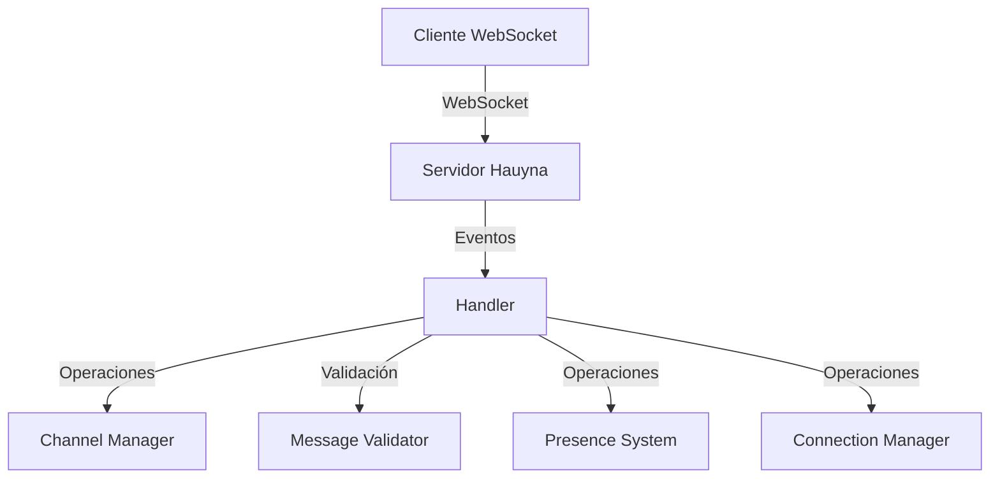
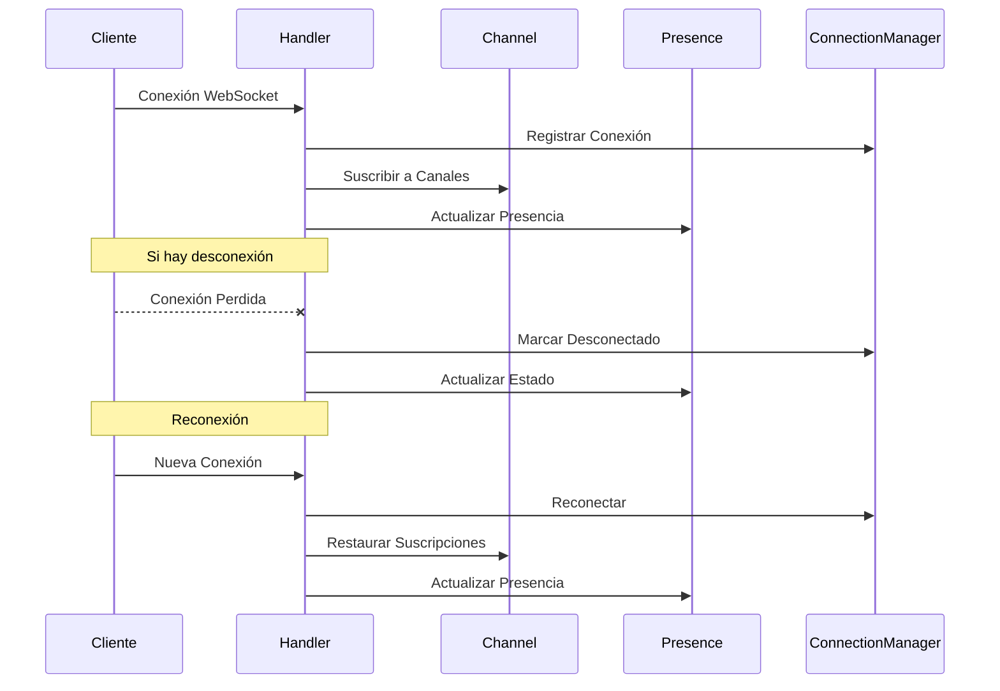
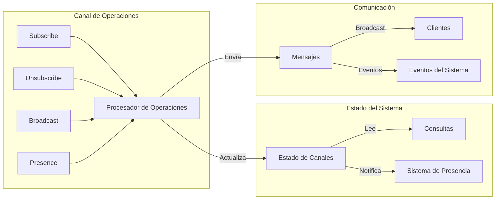
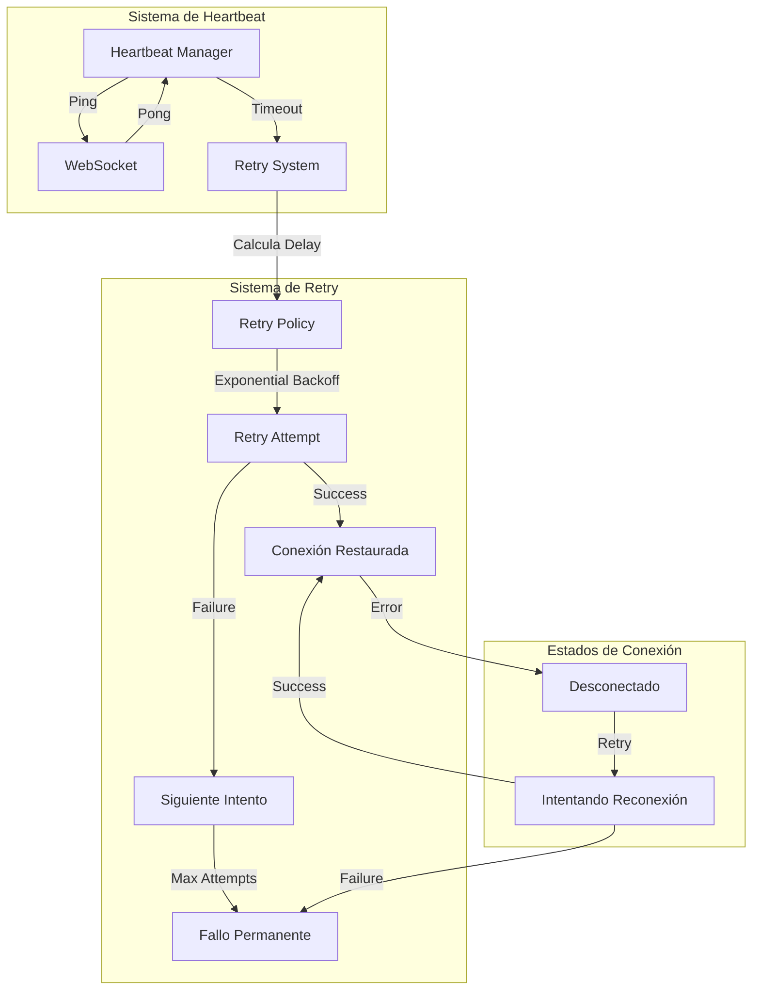
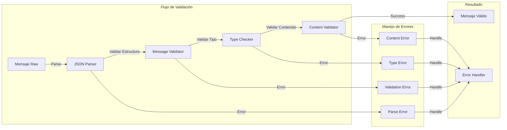
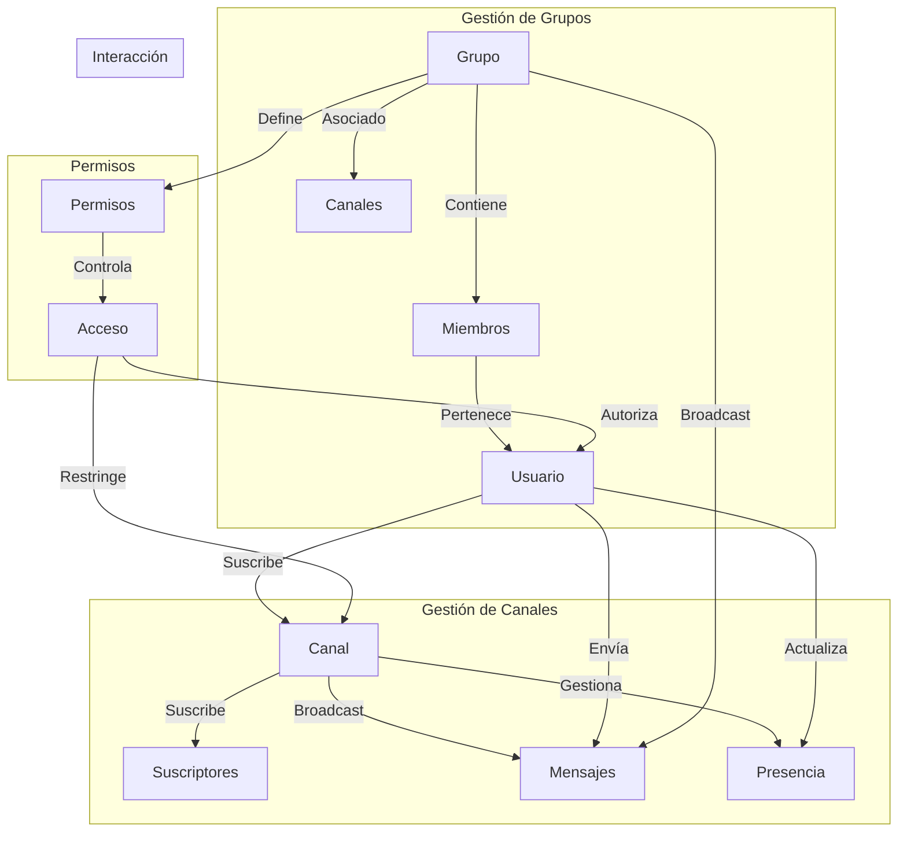
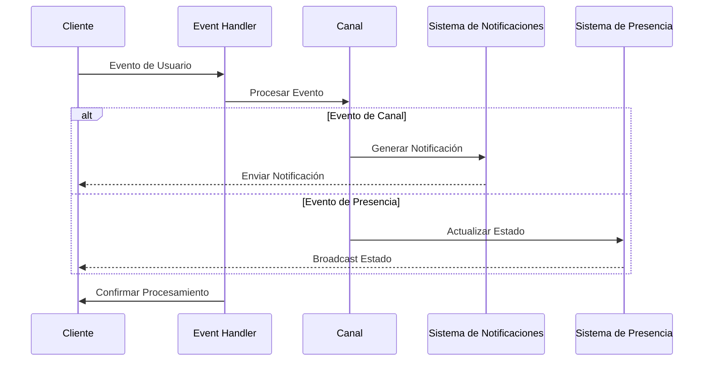

# Hauyna WebSocket

[](https://crystal-lang.org)
[](LICENSE)

**Hauyna WebSocket** es una biblioteca Crystal diseñada para simplificar la implementación de aplicaciones WebSocket en tiempo real. Proporciona un conjunto completo de herramientas para gestionar conexiones WebSocket, canales, grupos, seguimiento de presencia, manejo de eventos y más.

## Quick Start

```crystal
# 1. Añade la dependencia a shard.yml
dependencies:
  hauyna-web-socket:
    github: hauyna/hauyna-web-socket
    version: ~> 1.0.1

# 2. Crea un servidor básico
require "hauyna-web-socket"

handler = Hauyna::WebSocket::Handler.new(
  extract_identifier: ->(socket, params) { params["user_id"]?.try(&.as_s) || "anon" }
)

router = Hauyna::WebSocket::Router.new
router.websocket "/ws", handler

server = HTTP::Server.new do |context|
  router.call(context)
end

server.listen(8080)
```

## 🚀 Características Principales

- 📡 **Sistema de canales para comunicación en tiempo real**
  - Suscripciones flexibles a múltiples canales
  - Broadcast selectivo por canal
  - Gestión de metadatos por suscripción
  - Eventos automáticos de suscripción/desuscripción
  - Limpieza automática de suscripciones

- 👥 **Sistema de presencia con metadatos**
  - Tracking en tiempo real de usuarios
  - Metadatos personalizables por usuario
  - Filtrado por canal o grupo
  - Eventos de cambio de estado
  - Consultas por criterios múltiples

- 🔄 **Gestión de conexiones y grupos**
  - Identificación única de conexiones
  - Sistema de grupos dinámicos
  - Mensajería directa y broadcast
  - Limpieza automática de conexiones
  - Gestión thread-safe con mutex

- ❤️ **Características Avanzadas**
  - Heartbeat automático
  - Reconexión automática
  - Manejo de errores robusto
  - Estados de conexión detallados
  - Sistema de logging configurable

## Arquitectura

### Diagrama General



### Flujo de Operaciones



### Sistema de Canales



### Sistema de Retry y Heartbeat



### Sistema de Validación de Mensajes



### Sistema de Grupos y Canales



### Sistema de Eventos y Notificaciones



## Compatibilidad

| Crystal Version | Hauyna Version | Estado |
|----------------|----------------|---------|
| 1.15.x         | 1.0.1         | ✅      |
| 1.14.x         | 1.0.0         | ✅      |

## Documentación

- [Guía de Chat](docs/guides/chat.md)
- [Sistema de Notificaciones](docs/guides/notifications.md)
- [Sistema de Presencia](docs/guides/presence.md)
- [API Reference](docs/API.md)
- [Ejemplos Avanzados](docs/examples.md)
- [Troubleshooting](docs/troubleshooting.md)

## Autores

<table>
  <tr>
    <td align="center">
      <a href="https://github.com/Stockers-JAPG">
        <br />
        <sub><b>José Antonio Padre García</b></sub>
      </a>
    </td>
    <td align="center">
      <a href="https://github.com/LuisPadre25">
        <br />
        <sub><b>Luis Antonio Padre García</b></sub>
      </a>
    </td>
  </tr>
</table>

## Licencia

Este proyecto está licenciado bajo la Licencia MIT - ver el archivo [LICENSE](LICENSE) para más detalles.
