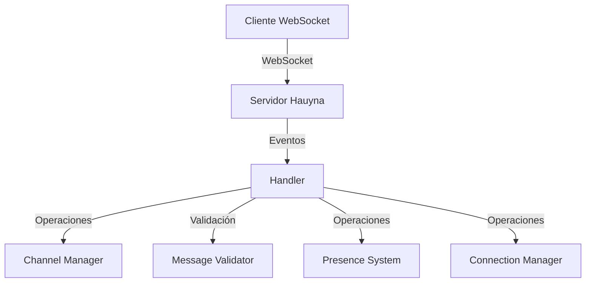
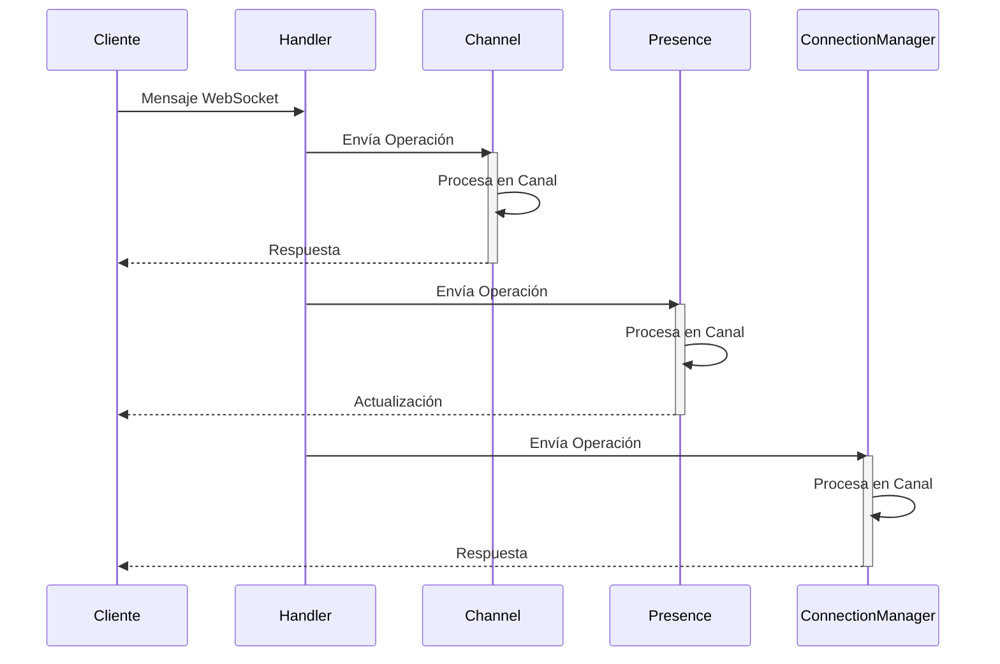
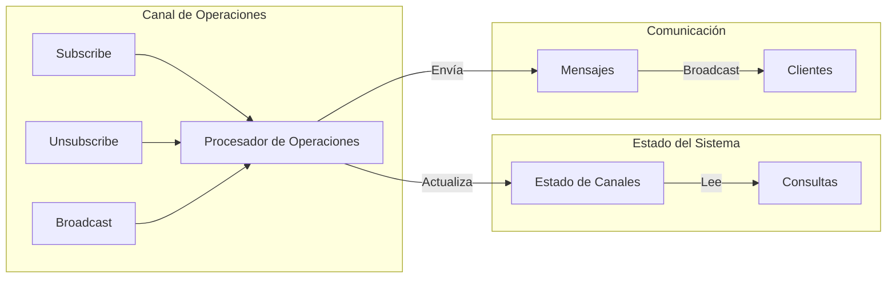

# Hauyna WebSocket

[](https://crystal-lang.org)
[](LICENSE)

**Hauyna WebSocket** es una biblioteca Crystal diseñada para simplificar la implementación de aplicaciones WebSocket en tiempo real. Proporciona un conjunto completo de herramientas para gestionar conexiones WebSocket, canales, grupos, seguimiento de presencia, manejo de eventos y más.

## Quick Start

```crystal
# 1. Añade la dependencia a shard.yml
dependencies:
  hauyna-web-socket:
    github: hauyna/hauyna-web-socket
    version: ~> 1.0.1

# 2. Crea un servidor básico
require "hauyna-web-socket"

handler = Hauyna::WebSocket::Handler.new(
  extract_identifier: ->(socket, params) { params["user_id"]?.try(&.as_s) || "anon" }
)

router = Hauyna::WebSocket::Router.new
router.websocket "/ws", handler

server = HTTP::Server.new do |context|
  router.call(context)
end

server.listen(8080)
```

## 🚀 Características Principales

- 📡 **Sistema de canales para comunicación en tiempo real**
  - Suscripciones flexibles a múltiples canales
  - Broadcast selectivo por canal
  - Gestión de metadatos por suscripción
  - Eventos automáticos de suscripción/desuscripción
  - Limpieza automática de suscripciones

- 👥 **Sistema de presencia con metadatos**
  - Tracking en tiempo real de usuarios
  - Metadatos personalizables por usuario
  - Filtrado por canal o grupo
  - Eventos de cambio de estado
  - Consultas por criterios múltiples

- 🔄 **Gestión de conexiones y grupos**
  - Identificación única de conexiones
  - Sistema de grupos dinámicos
  - Mensajería directa y broadcast
  - Limpieza automática de conexiones
  - Gestión thread-safe con mutex

- ❤️ **Características Avanzadas**
  - Heartbeat automático
  - Reconexión automática
  - Manejo de errores robusto
  - Estados de conexión detallados
  - Sistema de logging configurable

## Arquitectura

### Diagrama General


```mermaid
graph TB
    Client[Cliente WebSocket] -->|WebSocket| Server[Servidor Hauyna]
    Server -->|Eventos| Handler[Handler]
    Handler -->|Operaciones| ChannelManager[Channel Manager]
    Handler -->|Validación| MessageValidator[Message Validator]
    Handler -->|Operaciones| PresenceSystem[Presence System]
    Handler -->|Operaciones| ConnectionManager[Connection Manager]
```

### Flujo de Operaciones


```mermaid
sequenceDiagram
    participant C as Cliente
    participant H as Handler
    participant Ch as Channel
    participant P as Presence
    participant CM as ConnectionManager
    
    C->>H: Mensaje WebSocket
    H->>Ch: Envía Operación
    activate Ch
    Ch->>Ch: Procesa en Canal
    Ch-->>C: Respuesta
    deactivate Ch
    
    H->>P: Envía Operación
    activate P
    P->>P: Procesa en Canal
    P-->>C: Actualización
    deactivate P
    
    H->>CM: Envía Operación
    activate CM
    CM->>CM: Procesa en Canal
    CM-->>C: Respuesta
    deactivate CM
```

### Sistema de Canales con Operaciones


```mermaid
graph LR
    subgraph "Canal de Operaciones"
        Op1[Subscribe] --> Processor
        Op2[Unsubscribe] --> Processor
        Op3[Broadcast] --> Processor
        Processor[Procesador de Operaciones]
    end
    
    subgraph "Estado del Sistema"
        Processor -->|Actualiza| State[Estado de Canales]
        State -->|Lee| Queries[Consultas]
    end
    
    subgraph "Comunicación"
        Processor -->|Envía| Messages[Mensajes]
        Messages -->|Broadcast| Clients[Clientes]
    end
```

## Compatibilidad

| Crystal Version | Hauyna Version | Estado |
|----------------|----------------|---------|
| 1.15.x         | 1.0.1         | ✅      |
| 1.14.x         | 1.0.0         | ✅      |

## Documentación

- [Características Detalladas](docs/detailed_features.md)
- [Guía de Chat](docs/guides/chat.md)
- [Sistema de Notificaciones](docs/guides/notifications.md)
- [Sistema de Presencia](docs/guides/presence.md)
- [API Reference](docs/API.md)
- [Ejemplos Avanzados](docs/examples.md)
- [Troubleshooting](docs/troubleshooting.md)

## Autores

<table>
  <tr>
    <td align="center">
      <a href="https://github.com/Stockers-JAPG">
        <br />
        <sub><b>José Antonio Padre García</b></sub>
      </a>
    </td>
    <td align="center">
      <a href="https://github.com/LuisPadre25">
        <br />
        <sub><b>Luis Antonio Padre García</b></sub>
      </a>
    </td>
  </tr>
</table>

## Licencia

Este proyecto está licenciado bajo la Licencia MIT - ver el archivo [LICENSE](LICENSE) para más detalles.
