# Hauyna WebSocket

[](https://crystal-lang.org)
[](LICENSE)

**Hauyna WebSocket** es una biblioteca Crystal diseñada para simplificar la implementación de aplicaciones WebSocket en tiempo real. Proporciona un conjunto completo de herramientas para gestionar conexiones WebSocket, canales, grupos, seguimiento de presencia, manejo de eventos y más.


🚀 **Características Destacadas**:
- 📡 Sistema de canales para comunicación en tiempo real
- 👥 Gestión avanzada de grupos y conexiones
- 🔄 Eventos personalizables y sistema de presencia
- ❤️ Monitoreo de salud con heartbeat automático
- 🔁 Manejo automático de reconexiones
- 🛡️ Manejo robusto de errores
- 🎯 Enrutamiento dinámico de WebSockets
- 🔍 Validación de mensajes
- 👀 Sistema de presencia en tiempo real
- 🔐 Gestión de sesiones y autenticación
- 🌐 Soporte para múltiples canales
- 📊 Metadatos personalizables
- 🔄 Reconexión automática
- 📨 Broadcast y mensajes directos
- 🎭 Roles y permisos por grupo

## Tabla de Contenidos

- [Características](#características)
- [Arquitectura](#arquitectura)
  - [Diagrama General](#diagrama-general)
  - [Flujo de Mensajes](#flujo-de-mensajes)
  - [Arquitectura de Canales](#arquitectura-de-canales)
  - [Sistema de Presencia](#sistema-de-presencia)
- [Instalación](#instalación)
- [Uso](#uso)
  - [Configurando el Enrutador](#configurando-el-enrutador)
  - [Creando un Manejador de WebSocket](#creando-un-manejador-de-websocket)
  - [Gestionando Canales](#gestionando-canales)
  - [Manejo de Eventos](#manejo-de-eventos)
  - [Gestionando Conexiones y Grupos](#gestionando-conexiones-y-grupos)
  - [Seguimiento de Presencia](#seguimiento-de-presencia)
  - [Manejo de Errores](#manejo-de-errores)
  - [Mecanismo de Heartbeat](#mecanismo-de-heartbeat)
- [Referencia de la API](#referencia-de-la-api)
- [Ejemplos](#ejemplos)
- [Ejemplos Prácticos](#ejemplos-prácticos)
- [Contribuciones](#contribuciones)
- [Autores](#autores)
- [Licencia](#licencia)


## Características 

### Sistema de Canales
- **Suscripciones Flexibles**: Suscribe sockets a múltiples canales con metadatos personalizados
- **Broadcast Selectivo**: Envía mensajes a canales específicos o grupos de usuarios
- **Gestión de Suscriptores**: Monitorea y administra suscriptores por canal
- **Eventos de Canal**: Notificaciones automáticas de suscripción/desuscripción
- **Metadatos por Canal**: Almacena información adicional por suscripción

### Sistema de Presencia
- **Estado en Tiempo Real**: Monitoreo del estado de usuarios (online/away/offline)
- **Metadatos de Usuario**: Almacena información personalizada por usuario
- **Filtrado por Contexto**: Busca usuarios por canal, grupo o criterios personalizados
- **Eventos de Presencia**: Notificaciones automáticas de cambios de estado
- **Estadísticas**: Conteo y análisis de usuarios presentes

### Gestión de Conexiones
- **Identificación Única**: Sistema de identificadores para conexiones
- **Agrupación**: Organiza usuarios en grupos para mensajes dirigidos
- **Mensajes Directos**: Envía mensajes a usuarios específicos
- **Broadcast**: Envía mensajes a todos los usuarios o grupos
- **Limpieza Automática**: Gestión de desconexiones y limpieza de recursos
- **Estados de Conexión**: Monitoreo detallado del estado de cada conexión
- **Timestamps de Estado**: Seguimiento temporal de cambios de estado
- **Notificaciones de Estado**: Eventos automáticos de cambio de estado
- **Transiciones de Estado**: Sistema validado de cambios de estado
- **Hooks de Estado**: Callbacks personalizables para cambios de estado
- **Estados Personalizables**: API para definir transiciones válidas

### Sistema de Eventos
- **Eventos Personalizados**: Define y maneja eventos específicos de la aplicación
- **Callbacks**: Manejadores de eventos flexibles
- **Propagación**: Control sobre la propagación de eventos
- **Tipos de Eventos**: Soporte para eventos de sistema y usuario
- **Contexto**: Acceso al contexto completo en los manejadores

### Heartbeat y Monitoreo
- **Ping/Pong Automático**: Verificación periódica de conexiones
- **Timeouts Configurables**: Ajusta intervalos de verificación
- **Reconexión**: Manejo automático de reconexiones
- **Estado de Conexión**: Monitoreo del estado de la conexión
- **Limpieza**: Cierre automático de conexiones inactivas

### Manejo de Errores
- **Validación de Mensajes**: Verificación automática de formato y contenido
- **Errores Tipados**: Diferentes tipos de errores para mejor manejo
- **Respuestas de Error**: Formato consistente de mensajes de error
- **Recuperación**: Estrategias de recuperación de errores
- **Logging**: Registro detallado de errores

### Enrutamiento
- **Rutas Dinámicas**: Soporte para parámetros en URLs
- **Middleware**: Procesamiento previo de conexiones
- **Extracción de Parámetros**: Parse automático de query params
- **Validación**: Verificación de upgrade y conexión WebSocket
- **Manejo de Contexto**: Acceso al contexto HTTP completo

### Manejo de Reconexiones

```crystal
# Ejemplo de manejo de reconexión
handler = Hauyna::WebSocket::Handler.new(
  on_reconnect: ->(new_socket : HTTP::WebSocket, old_socket : HTTP::WebSocket) {
    # Transferir suscripciones al nuevo socket
    Hauyna::WebSocket::Channel.handle_reconnection(new_socket, old_socket)
  }
)
```

El sistema maneja automáticamente:
- Transferencia de suscripciones
- Notificación de reconexión a los canales
- Actualización del estado de presencia
- Mantenimiento de metadatos

## Arquitectura

### Diagrama General


### Flujo de Operaciones

```mermaid
sequenceDiagram
    participant C as Cliente
    participant H as Handler
    participant Ch as Channel
    participant P as Presence
    participant CM as ConnectionManager
    
    C->>H: Mensaje WebSocket
    H->>Ch: Envía Operación
    activate Ch
    Ch->>Ch: Procesa en Canal
    Ch-->>C: Respuesta
    deactivate Ch
    
    H->>P: Envía Operación
    activate P
    P->>P: Procesa en Canal
    P-->>C: Actualización
    deactivate P
    
    H->>CM: Envía Operación
    activate CM
    CM->>CM: Procesa en Canal
    CM-->>C: Respuesta
    deactivate CM
```



### Sistema de Canales con Operaciones

```mermaid
graph LR
    subgraph "Canal de Operaciones"
        Op1[Subscribe] --> Processor
        Op2[Unsubscribe] --> Processor
        Op3[Broadcast] --> Processor
        Processor[Procesador de Operaciones]
    end
    
    subgraph "Estado del Sistema"
        Processor -->|Actualiza| State[Estado de Canales]
        State -->|Lee| Queries[Consultas]
    end
    
    subgraph "Comunicación"
        Processor -->|Envía| Messages[Mensajes]
        Messages -->|Broadcast| Clients[Clientes]
    end
```



## Estados de Conexión
```crystal
# Verificar estado actual de una conexión
if state = ConnectionManager.get_connection_state(socket)
  case state
  when ConnectionState::Connected
    puts "Socket conectado y activo"
  when ConnectionState::Idle
    puts "Socket inactivo"
  when ConnectionState::Error
    puts "Socket con error"
  when ConnectionState::Disconnected
    puts "Socket desconectado"
  when ConnectionState::Reconnecting
    puts "Socket en proceso de reconexión"
  end
end

# Obtener sockets por estado
idle_sockets = ConnectionManager.connections_in_state(ConnectionState::Idle)
puts "Hay #{idle_sockets.size} conexiones inactivas"

# Verificar tiempo en estado actual
if timestamp = ConnectionManager.get_state_timestamp(socket)
  time_in_state = Time.local - timestamp
  puts "Socket ha estado en este estado por #{time_in_state.total_seconds} segundos"
end
```

### Estados Disponibles
- `Connected`: Socket conectado y funcionando normalmente
- `Disconnected`: Socket desconectado del servidor
- `Reconnecting`: Socket en proceso de reconexión
- `Error`: Socket en estado de error
- `Idle`: Socket conectado pero sin actividad reciente

## Instalación

Añade la dependencia a tu `shard.yml`:

```yaml
dependencies:
  hauyna-web-socket:
    github: Hauyna/hauyna-web-socket
    version: ~> 1.0.0
```

Ejecuta `shards install` para instalar la shard.

## Uso

### Configurando el Enrutador

```crystal
require "hauyna-web-socket"

# Crear el router
router = Hauyna::WebSocket::Router.new

# Configurar el handler con las callbacks necesarias
handler = Hauyna::WebSocket::Handler.new(
  extract_identifier: ->(socket : HTTP::WebSocket, params : JSON::Any) : String {
    # Si no hay user_id, usamos un ID generado
    params["user_id"]?.try(&.as_s) || "anonymous_#{Random::Secure.hex(8)}"
  },
  on_open: ->(socket : HTTP::WebSocket, params : JSON::Any) {
    puts "Nueva conexión WebSocket con params: #{params}"
  },
  on_message: ->(socket : HTTP::WebSocket, message : JSON::Any) {
    puts "Mensaje recibido: #{message}"
    # Procesar el mensaje según su tipo
    case message["type"]?.try(&.as_s)
    when "chat_message"
      if content = message["content"]?.try(&.as_s)
        if identifier = Hauyna::WebSocket::ConnectionManager.get_identifier(socket)
          message_hash = {
            "type" => JSON::Any.new("message"),
            "user" => JSON::Any.new(identifier),
            "content" => JSON::Any.new(content)
          }
          Hauyna::WebSocket::Channel.broadcast_to("chat", message_hash)
        end
      end
    end
  },
  on_close: ->(socket : HTTP::WebSocket) {
    puts "Conexión cerrada"
  },
  heartbeat_interval: 30.seconds
)

# Registrar la ruta WebSocket
router.websocket "/chat", handler

# Iniciar el servidor
server = HTTP::Server.new do |context|
  if router.call(context)
    # WebSocket manejado
  else
    context.response.status_code = 404
    context.response.print "Not Found"
  end
end

puts "Servidor iniciado en http://localhost:8080"
server.listen("0.0.0.0", 8080)
```

### Gestionando Canales

```crystal
# En el manejador on_message:
on_message: ->(socket : HTTP::WebSocket, message : JSON::Any) {
  case message["type"]?.try(&.as_s)
  when "subscribe_channel"
    if channel = message["channel"]?.try(&.as_s)
      if identifier = Hauyna::WebSocket::ConnectionManager.get_identifier(socket)
        Hauyna::WebSocket::Channel.subscribe(
          channel,
          socket,
          identifier,
          {"role" => JSON::Any.new("user")}
        )
      end
    end
  when "channel_message"
    if channel = message["channel"]?.try(&.as_s)
      if Hauyna::WebSocket::Channel.subscribed?(channel, socket)
        if content = message["content"]?.try(&.as_s)
          if identifier = Hauyna::WebSocket::ConnectionManager.get_identifier(socket)
            message_hash = {
              "type" => JSON::Any.new("message"),
              "user" => JSON::Any.new(identifier),
              "content" => JSON::Any.new(content)
            }
            Hauyna::WebSocket::Channel.broadcast_to(channel, message_hash)
          end
        end
      end
    end
  end
}
```

### Sistema de Presencia

```crystal
# En el manejador on_open:
on_open: ->(socket : HTTP::WebSocket, params : JSON::Any) {
  if identifier = params["user_id"]?.try(&.as_s)
    # Registrar presencia
    Hauyna::WebSocket::Presence.track(identifier, {
      "status" => JSON::Any.new("online"),
      "last_seen" => JSON::Any.new(Time.local.to_s)
    })
  end
}

# En el manejador on_message para actualizar estado:
on_message: ->(socket : HTTP::WebSocket, message : JSON::Any) {
  case message["type"]?.try(&.as_s)
  when "update_status"
    if identifier = Hauyna::WebSocket::ConnectionManager.get_identifier(socket)
      if status = message["status"]?.try(&.as_s)
        Hauyna::WebSocket::Presence.update_state(identifier, {
          "status" => JSON::Any.new(status),
          "last_seen" => JSON::Any.new(Time.local.to_s)
        })
      end
    end
  end
}

# Consultar usuarios presentes
users = Hauyna::WebSocket::Presence.list
```

### Ejemplo de Cliente JavaScript

```javascript
// Conectar al WebSocket
const ws = new WebSocket('ws://localhost:8080/chat?user_id=123');

ws.onopen = () => {
  console.log('Conectado al servidor');
  
  // Suscribirse a un canal
  ws.send(JSON.stringify({
    type: 'subscribe_channel',
    channel: 'chat'
  }));
};

ws.onmessage = (event) => {
  const data = JSON.parse(event.data);
  console.log('Mensaje recibido:', data);
  
  // Manejar diferentes tipos de mensajes
  switch(data.type) {
    case 'message':
      console.log(`${data.user}: ${data.content}`);
      break;
    case 'presence_change':
      console.log(`Usuario ${data.user} está ${data.metadata.status}`);
      break;
  }
};

// Enviar mensaje al canal
function sendMessage(content) {
  ws.send(JSON.stringify({
    type: 'channel_message',
    channel: 'chat',
    content: content
  }));
}

// Actualizar estado
function updateStatus(status) {
  ws.send(JSON.stringify({
    type: 'update_status',
    status: status
  }));
}

// Manejar reconexión
ws.onclose = () => {
  console.log('Conexión cerrada. Intentando reconectar...');
  setTimeout(() => {
    new WebSocket('ws://localhost:8080/chat?user_id=123');
  }, 5000);
};
```

### Ejemplo Completo de Chat

```crystal
require "hauyna-web-socket"

# Configurar el router
router = Hauyna::WebSocket::Router.new

# Crear el manejador de chat
chat_handler = Hauyna::WebSocket::Handler.new(
  extract_identifier: ->(socket : HTTP::WebSocket, params : JSON::Any) : String {
    params["user_id"]?.try(&.as_s) || raise "User ID is required"
  },
  
  on_open: ->(socket : HTTP::WebSocket, params : JSON::Any) {
    identifier = params["user_id"]?.try(&.as_s) || raise "User ID is required"
    # Registrar presencia
    Hauyna::WebSocket::Presence.track(identifier, {
      "status" => JSON::Any.new("online"),
      "last_seen" => JSON::Any.new(Time.local.to_s)
    })
    
    # Suscribir al canal general
    Hauyna::WebSocket::Channel.subscribe("general", socket, identifier)
    
    # Notificar a todos los usuarios
    system_message = {
      "type" => JSON::Any.new("system"),
      "message" => JSON::Any.new("#{identifier} se ha unido al chat")
    }
    Hauyna::WebSocket::Channel.broadcast_to("general", system_message)
  },
  
  on_message: ->(socket : HTTP::WebSocket, message : JSON::Any) {
    case message["type"]?.try(&.as_s)
    when "chat_message"
      if content = message["content"]?.try(&.as_s)
        if identifier = Hauyna::WebSocket::ConnectionManager.get_identifier(socket)
          chat_message = {
            "type" => JSON::Any.new("message"),
            "user" => JSON::Any.new(identifier),
            "content" => JSON::Any.new(content),
            "timestamp" => JSON::Any.new(Time.local.to_s)
          }
          Hauyna::WebSocket::Channel.broadcast_to("general", chat_message)
        end
      end
    when "status_update"
      if status = message["status"]?.try(&.as_s)
        if identifier = Hauyna::WebSocket::ConnectionManager.get_identifier(socket)
          Hauyna::WebSocket::Presence.update_state(identifier, {
            "status" => JSON::Any.new(status),
            "last_seen" => JSON::Any.new(Time.local.to_s)
          })
        end
      end
    end
  },
  
  on_close: ->(socket : HTTP::WebSocket) {
    if identifier = Hauyna::WebSocket::ConnectionManager.get_identifier(socket)
      # Limpiar presencia
      Hauyna::WebSocket::Presence.untrack(identifier)
      
      # Notificar a los demás
      close_message = {
        "type" => JSON::Any.new("system"),
        "message" => JSON::Any.new("#{identifier} ha salido del chat")
      }
      Hauyna::WebSocket::Channel.broadcast_to("general", close_message)
    end
  },
  
  heartbeat_interval: 30.seconds
)

# Registrar la ruta
router.websocket "/chat", chat_handler

# Iniciar el servidor
server = HTTP::Server.new do |context|
  if router.call(context)
    # WebSocket manejado
  else
    context.response.status_code = 404
    context.response.print "Not Found"
  end
end

puts "Servidor de chat iniciado en http://localhost:8080"
server.listen("0.0.0.0", 8080)
```

## Ejemplos Prácticos

### Sistema de Notificaciones en Tiempo Real
```crystal
# Configurar el manejador de notificaciones
notification_handler = Hauyna::WebSocket::Handler.new(
  extract_identifier: ->(socket : HTTP::WebSocket, params : JSON::Any) : String {
    params["user_id"]?.try(&.as_s) || raise "User ID is required"
  },
  on_open: ->(socket : HTTP::WebSocket, params : JSON::Any) {
    identifier = params["user_id"]?.try(&.as_s) || raise "User ID is required"
    # Suscribir al canal de notificaciones personal
    Hauyna::WebSocket::Channel.subscribe("notifications:#{identifier}", socket, identifier)
    # Registrar presencia con rol
    Hauyna::WebSocket::Presence.track(identifier, {
      "status" => JSON::Any.new("online"),
      "role" => JSON::Any.new("user"),
      "last_seen" => JSON::Any.new(Time.local.to_s)
    })
  }
)

# Enviar notificación a un usuario específico
def send_notification(user_id : String, notification : Hash)
  Hauyna::WebSocket::Channel.broadcast_to(
    "notifications:#{user_id}",
    {
      type: "notification",
      data: notification
    }
  )
end
```

### Sistema de Chat con Salas
```crystal
# Manejador de chat con salas
chat_handler = Hauyna::WebSocket::Handler.new(
  extract_identifier: ->(socket : HTTP::WebSocket, params : JSON::Any) : String {
    params["user_id"]?.try(&.as_s) || raise "User ID is required"
  },
  on_message: ->(socket : HTTP::WebSocket, message : JSON::Any) {
    case message["type"]?.try(&.as_s)
    when "join_room"
      room = message["room"]?.try(&.as_s)
      identifier = Hauyna::WebSocket::ConnectionManager.get_identifier(socket)
      if room && identifier
        Hauyna::WebSocket::Channel.subscribe(room, socket, identifier, {
          "joined_at" => JSON::Any.new(Time.local.to_s)
        })
      end
    when "room_message"
      room = message["room"]?.try(&.as_s)
      content = message["content"]?.try(&.as_s)
      identifier = Hauyna::WebSocket::ConnectionManager.get_identifier(socket)
      if room && content && identifier
        message_hash = {
          "type" => JSON::Any.new("message"),
          "user" => JSON::Any.new(identifier),
          "content" => JSON::Any.new(content),
          "timestamp" => JSON::Any.new(Time.local.to_s)
        }
        Hauyna::WebSocket::Channel.broadcast_to(room, message_hash)
      end
    end
  }
)
```

### Sistema de Presencia Avanzado
```crystal
# Configurar presencia con estados personalizados
presence_handler = Hauyna::WebSocket::Handler.new(
  on_open: ->(socket : HTTP::WebSocket, params : JSON::Any) {
    user_id = params["user_id"]?.try(&.as_s)
    if user_id
      Hauyna::WebSocket::Presence.track(user_id, {
        "status" => JSON::Any.new("online"),
        "activity" => JSON::Any.new("idle"),
        "device" => JSON::Any.new(params["device"]?.try(&.as_s) || "unknown"),
        "permissions" => JSON::Any.new([
          "read",
          "write"
        ].to_json)
      })
    end
  }
)

# Actualizar estado de actividad
def update_user_activity(user_id : String, activity : String)
  Hauyna::WebSocket::Presence.update_state(user_id, {
    "activity" => JSON::Any.new(activity),
    "last_activity" => JSON::Any.new(Time.local.to_s)
  })
end

# Obtener usuarios activos por criterios
def get_active_users(criteria : Hash(String, String))
  Hauyna::WebSocket::Presence.list_by(criteria)
end
```

### Sistema de Grupos y Permisos
```crystal
# Gestionar grupos y permisos
def manage_user_groups(user_id : String)
  # Añadir a grupo con rol
  ConnectionManager.add_to_group(user_id, "admins")
  
  # Enviar mensaje solo a administradores
  ConnectionManager.send_to_group("admins", {
    type: "admin_notification",
    message: "Nueva actualización disponible"
  }.to_json)
  
  # Verificar permisos
  if ConnectionManager.is_in_group?(user_id, "admins")
    # Realizar acciones administrativas
  end
end
```

## Ejemplo de Manejo de Estados y Transiciones
```crystal
# Configurar política de reintentos personalizada
retry_policy = ConnectionManager::RetryPolicy.new(
  max_attempts: 5,
  base_delay: 1.seconds,
  max_delay: 30.seconds,
  backoff_multiplier: 2.0,
  jitter: 0.1
)

# Asignar política al socket
ConnectionManager.set_retry_policy(socket, retry_policy)

# Registrar un hook para monitorear cambios de estado
ConnectionManager.on_state_change do |socket, old_state, new_state|
  puts "Socket #{socket.object_id} cambió de #{old_state} a #{new_state}"
  
  # Monitorear reintentos
  if new_state == ConnectionState::Reconnecting
    puts "Intentando reconexión..."
  elsif new_state == ConnectionState::Connected
    puts "Reconexión exitosa!"
  end
end
```

### Políticas de Reintento
```crystal
# Política con backoff exponencial y jitter
policy = ConnectionManager::RetryPolicy.new(
  max_attempts: 5,        # Máximo número de intentos
  base_delay: 1.seconds,  # Delay inicial
  max_delay: 30.seconds,  # Delay máximo
  backoff_multiplier: 2.0,# Multiplicador de backoff
  jitter: 0.1            # Factor de aleatoriedad
)

# Los delays resultantes serían aproximadamente:
# Intento 1: ~1 segundo
# Intento 2: ~2 segundos
# Intento 3: ~4 segundos
# Intento 4: ~8 segundos
# Intento 5: ~16 segundos
```

### Configuración de Políticas de Reintento
```crystal
# Política con backoff exponencial y jitter
policy = ConnectionManager::RetryPolicy.new(
  max_attempts: 5,        # Máximo número de intentos
  base_delay: 1.seconds,  # Delay inicial
  max_delay: 30.seconds,  # Delay máximo
  backoff_multiplier: 2.0,# Multiplicador de backoff
  jitter: 0.1            # Factor de aleatoriedad
)

# Ejemplo de uso con diferentes configuraciones

# Política agresiva (reintentos rápidos)
aggressive_policy = ConnectionManager::RetryPolicy.new(
  max_attempts: 10,
  base_delay: 0.5.seconds,
  max_delay: 5.seconds,
  backoff_multiplier: 1.5,
  jitter: 0.05
)

# Política conservadora (reintentos más espaciados)
conservative_policy = ConnectionManager::RetryPolicy.new(
  max_attempts: 3,
  base_delay: 5.seconds,
  max_delay: 60.seconds,
  backoff_multiplier: 3.0,
  jitter: 0.2
)

# Asignar política según el tipo de conexión
if is_critical_connection
  ConnectionManager.set_retry_policy(socket, aggressive_policy)
else
  ConnectionManager.set_retry_policy(socket, conservative_policy)
end
```

## Referencia Completa de la API

### Accediendo a los Métodos
```crystal
# Primero, incluye la librería
require "hauyna-web-socket"

# Puedes acceder a los métodos usando el namespace completo:
Hauyna::WebSocket::Channel.subscribe(...)
Hauyna::WebSocket::Presence.track(...)
Hauyna::WebSocket::ConnectionManager.register(...)

# O crear alias para un acceso más corto:
alias WSChannel = Hauyna::WebSocket::Channel
alias WSPresence = Hauyna::WebSocket::Presence
alias WSConnection = Hauyna::WebSocket::ConnectionManager

# Y luego usarlos así:
WSChannel.subscribe(...)
WSPresence.track(...)
WSConnection.register(...)
```

### Clase Channel
```crystal
# Suscribe un socket a un canal
# Ejemplo:
WSChannel.subscribe("chat", socket, "user_123", {
  "role" => JSON::Any.new("user"),
  "joined_at" => JSON::Any.new(Time.local.to_s)
})

# Desuscribe un socket de un canal
# Ejemplo:
WSChannel.unsubscribe("chat", socket)

# Envía mensaje a todos los suscriptores de un canal
# Ejemplo:
users = WSChannel.subscribers("chat") # => ["user_123", "user_456"]

# Obtiene canales suscritos por un socket
# Ejemplo:
channels = WSChannel.subscribed_channels(socket) # => ["chat", "notifications"]

# Verifica si un socket está suscrito a un canal
# Ejemplo:
if WSChannel.subscribed?("chat", socket)
  puts "Usuario está en el chat"
end
```

### Clase Presence
```crystal
# Registra la presencia de un usuario con metadatos
# Ejemplo:
WSPresence.track("user_123", {
  "status" => JSON::Any.new("online"),
  "last_seen" => JSON::Any.new(Time.local.to_s)
})

# Lista usuarios presentes filtrados por canal o grupo
# Ejemplo:
online_users = WSPresence.list("chat") # Lista usuarios en el canal chat
admin_users = WSPresence.list(group: "admins") # Lista admins online

# Lista usuarios por criterios específicos
# Ejemplo:
active_admins = WSPresence.list_by({
  "status" => "online",
  "role" => "admin"
})

# Verifica presencia en contexto específico
# Ejemplo:
if WSPresence.present_in?("user_123", {"channel" => "chat"})
  puts "Usuario está en el chat"
end

# Actualiza estado de usuario
# Ejemplo:
WSPresence.update_state("user_123", {
  "status" => JSON::Any.new("away"),
  "last_activity" => JSON::Any.new(Time.local.to_s)
})
```

### Clase ConnectionManager
```crystal
# Registra una nueva conexión
# Ejemplo:
WSConnection.register(socket, "user_123")

# Añade usuario a grupo
# Ejemplo:
WSConnection.add_to_group("user_123", "admins")

# Envía mensaje a usuario específico
# Ejemplo:
WSConnection.send_to_one("user_123", {
  type: "notification",
  message: "Nuevo mensaje privado"
}.to_json)

# Envía mensaje a grupo
# Ejemplo:
WSConnection.send_to_group("admins", {
  type: "alert",
  message: "Mantenimiento programado"
}.to_json)

# Verifica pertenencia a grupo
# Ejemplo:
if WSConnection.is_in_group?("user_123", "admins")
  puts "Usuario es admin"
end
```

### Clase Handler
```crystal
# Inicializa un nuevo manejador
# Ejemplo:
handler = Handler.new(
  extract_identifier: ->(socket : HTTP::WebSocket, params : JSON::Any) : String {
    params["user_id"]?.try(&.as_s) || "anonymous"
  },
  on_message: ->(socket : HTTP::WebSocket, message : JSON::Any) {
    puts "Mensaje recibido: #{message}"
  },
  heartbeat_interval: 30.seconds
)
```

### Clase Heartbeat
```crystal
# Inicializa y configura heartbeat
# Ejemplo:
heartbeat = Heartbeat.new(
  interval: 30.seconds,
  timeout: 60.seconds
)
heartbeat.start(socket)
```

### Clase Router
```crystal
# Configura rutas WebSocket
# Ejemplo:
router = Router.new
router.websocket "/chat", chat_handler
router.websocket "/notifications", notification_handler

server = HTTP::Server.new do |context|
  router.call(context)
end
```

## Autores

Hauyna WebSocket es una librería creada y mantenida por [José Antonio Padre García](https://github.com/Stockers-JAPG) y [Luis Antonio Padre García](https://github.com/LuisPadre25).
Agradecemos tus comentarios, reportes de errores y sugerencias para seguir mejorando esta Libreria.

<table>
  <tr>
    <td align="center">
      <a href="https://github.com/Stockers-JAPG">
        <br />
        <sub><b>José Antonio Padre García</b></sub>
      </a>
    </td>
        <td align="center">
      <a href="https://github.com/LuisPadre25">
        <br />
        <sub><b>Luis Antonio Padre García</b></sub>
      </a>
    </td>
  </tr>
</table>

## Licencia

Este proyecto está licenciado bajo la Licencia MIT - ver el archivo [LICENSE](LICENSE) para más detalles.

---

**¡Disfruta desarrollando aplicaciones WebSocket potentes y rápidas con Hauyna!**  
Si encuentras problemas o sugerencias, crea un _issue_ en el repositorio oficial.
