# Hauyna WebSocket

Hauyna WebSocket es una biblioteca Crystal diseñada para simplificar la implementación de aplicaciones WebSocket en tiempo real. Proporciona una API intuitiva y robusta para manejar conexiones WebSocket, gestionar grupos de usuarios y enviar mensajes de manera eficiente.

  🚀 Sistema de canales y grupos para organizar comunicaciones

  🔒 Manejo seguro y thread-safe de conexiones

  ♻️ Reconexión automática y sistema de heartbeat

  👥 Sistema de presencia en tiempo real

  🔌 API intuitiva y fácil de usar

  📦 Integración sencilla con aplicaciones Crystal

  ⚡ Alto rendimiento y baja latencia

  🛡️ Validación de mensajes incorporada

  🔄 Manejo automático de reconexiones
  
  📊 Monitoreo de estado de conexiones


## Índice

- [Características Principales](#características-principales)
  - [Gestión de Conexiones](#gestión-de-conexiones)
  - [Sistema de Grupos](#sistema-de-grupos)
  - [Patrones de Mensajería](#patrones-de-mensajería)
  - [Manejo de Eventos](#manejo-de-eventos)
  - [Características de Seguridad](#características-de-seguridad)
  - [Características Destacadas](#características-destacadas)
  - [Características del Sistema](#características-del-sistema)
  - [Sistema de Canales](#sistema-de-canales)
  - [Sistema de Presencia](#sistema-de-presencia)
- [Casos de Uso](#casos-de-uso)
- [Instalación](#instalación)
- [Uso Básico](#uso-básico)
- [API](#api)
- [Ventajas](#ventajas)
- [Requisitos](#requisitos)
- [Contribución](#contribución)
- [Contribuidores](#contribuidores)
- [Licencia](#licencia)


## Características Principales

### Gestión de Conexiones
- Registro y seguimiento automático de conexiones WebSocket
- Identificación única de clientes
- Manejo seguro de desconexiones
- Soporte para múltiples conexiones simultáneas

### Sistema de Grupos
- Creación dinámica de grupos de usuarios
- Capacidad para añadir/remover usuarios de grupos
- Envío de mensajes a grupos específicos
- Gestión eficiente de membresías múltiples

### Patrones de Mensajería
- Broadcast a todos los clientes conectados
- Envío dirigido a usuarios específicos
- Mensajería grupal
- Soporte para diferentes formatos de mensaje

### Manejo de Eventos
- Sistema de eventos personalizable
- Callbacks para conexión, desconexión y mensajes
- Manejo de errores robusto
- Eventos personalizados definidos por el usuario

### Características de Seguridad
- Sincronización thread-safe con mutex
- Manejo seguro de desconexiones inesperadas
- Limpieza automática de conexiones muertas
- Validación de mensajes y conexiones

### Sistema de Heartbeat y Auto-Reconexión

Hauyna WebSocket incluye un sistema robusto de heartbeat y auto-reconexión para mantener las conexiones estables:

#### Heartbeat del Servidor

```crystal
# Configurar handler con heartbeat
handler = Hauyna::WebSocket::Handler.new(
  heartbeat_interval: 30.seconds,  # Intervalo entre pings
  heartbeat_timeout: 60.seconds,   # Tiempo máximo sin respuesta
  on_open: ->(socket : HTTP::WebSocket, params : JSON::Any) {
    puts "Nueva conexión establecida"
  }
)

# El heartbeat se maneja automáticamente:
# - Envía pings periódicos
# - Monitorea pongs
# - Cierra conexiones inactivas
# - Limpia recursos automáticamente
```

#### Cliente con Auto-Reconexión

```javascript
class WebSocketClient {
  constructor(url, options = {}) {
    this.url = url;
    this.options = {
      reconnectInterval: 1000,      // Intervalo entre intentos
      maxReconnectAttempts: 5,      // Máximo de intentos
      heartbeatInterval: 30000,     // Intervalo de heartbeat
      ...options
    };
    
    this.connect();
  }

  connect() {
    this.ws = new WebSocket(this.url);
    this.setupHeartbeat();
    this.setupReconnection();
  }

  setupHeartbeat() {
    // Enviar heartbeat periódicamente
    this.heartbeatInterval = setInterval(() => {
      if (this.ws.readyState === WebSocket.OPEN) {
        this.ws.send(JSON.stringify({ type: 'heartbeat' }));
      }
    }, this.options.heartbeatInterval);
  }

  setupReconnection() {
    this.ws.onclose = () => {
      if (this.reconnectAttempts < this.options.maxReconnectAttempts) {
        setTimeout(() => this.connect(), this.options.reconnectInterval);
        this.reconnectAttempts++;
      }
    };
  }
}

// Uso del cliente
const ws = new WebSocketClient('ws://localhost:3000/chat', {
  reconnectInterval: 2000,
  maxReconnectAttempts: 3,
  heartbeatInterval: 25000
});
```

#### Características del Sistema

- **Heartbeat del Servidor**:
  - 🔄 Monitoreo automático de conexiones activas
  - ⏱️ Intervalos configurables de ping/pong
  - 🚫 Cierre automático de conexiones muertas
  - 🧹 Limpieza automática de recursos

- **Auto-Reconexión del Cliente**:
  - 🔁 Reconexión automática en desconexiones
  - ⚙️ Intentos de reconexión configurables
  - ⏰ Intervalos de espera personalizables
  - 📊 Eventos para monitorear el estado

- **Beneficios**:
  - 💪 Conexiones más estables y robustas
  - 🛡️ Recuperación automática de fallos
  - 📉 Reducción de conexiones fantasma
  - 🔍 Mejor monitoreo del estado de conexión

### Sistema de Canales
- Suscripción y desuscripción dinámica a canales
- Mensajería específica por canal
- Auto-suscripción a canales al conectar
- Metadata personalizable por suscripción
- Broadcast eficiente a todos los miembros del canal
- Limpieza automática de suscripciones

### Sistema de Presencia
- Seguimiento en tiempo real de usuarios conectados
- Metadata personalizable por usuario
- Notificaciones de cambios de presencia
- Integración automática con canales
- Consulta de usuarios activos por grupo
- Estado de presencia persistente

### Diferencia entre Canales y Grupos

#### Canales
- **Propósito**: Comunicación en tiempo real y streaming de datos
- **Características**:
  - Suscripción explícita
  - Sistema de eventos propio
  - Mensajería bidireccional
  - Ideal para chats y streams
  - Estado de presencia por canal

```crystal
# Ejemplo de uso de canales
Channel.subscribe("sala-chat", socket, user_id)
Channel.broadcast_to("sala-chat", mensaje)

# Ejemplo de grupos
ConnectionManager.add_to_group(user_id, "moderadores")
ConnectionManager.send_to_group("moderadores", notificacion)
```

#### Grupos
- **Propósito**: Organización lógica y control de acceso
- **Características**:
  - Categorización de usuarios
  - Control de permisos
  - Segmentación de usuarios
  - Ideal para roles y accesos
  - Notificaciones grupales

```crystal
# Ejemplo de uso de grupos
ConnectionManager.add_to_group(user_id, "moderadores")

# Enviar notificación a un grupo
ConnectionManager.send_to_group("moderadores", {
  type: "notification",
  content: "Nueva alerta de moderación"
})

# Verificar pertenencia a grupo
ConnectionManager.is_in_group?(user_id, "moderadores")
```

#### Uso Combinado
```crystal
# Usuario en canal con rol específico
Channel.subscribe("support-chat", socket, user_id, {
  "group" => JSON::Any.new("support_team"),
  "role" => JSON::Any.new("agent")
})

# Listar usuarios por canal y grupo
Presence.list_by({
  "channel" => "support-chat",
  "group" => "support_team"
})
```

## Casos de Uso

La biblioteca es ideal para implementar:

- Chats en tiempo real
- Sistemas de notificaciones push
- Monitoreo en vivo
- Juegos multijugador
- Aplicaciones colaborativas
- Dashboards en tiempo real
- Sistemas IoT
- Streaming de datos

## Instalación

1. Agrega la dependencia a tu `shard.yml`:

```yaml
dependencies:
  hauyna-web-socket:
    github: tu-usuario/hauyna-web-socket
```

2. Instala las dependencias:

```bash
shards install
```

3. Importa la librería:

```crystal
require "hauyna-web-socket"
```

## Uso Básico

```crystal
require "hauyna-web-socket"

# Crear un manejador WebSocket
handler = Hauyna::WebSocket::Handler.new(
  # Identificar usuarios únicos
  extract_identifier: ->(socket : HTTP::WebSocket, params : JSON::Any) {
    params["user_id"]?.try(&.as_s)
  },

  # Manejar conexión nueva
  on_open: ->(socket : HTTP::WebSocket, params : JSON::Any) {
    user_id = params["user_id"]?.try(&.as_s)
    room = params["room"]?.try(&.as_s) || "general"
    
    # Agregar usuario a un grupo
    Hauyna::WebSocket::ConnectionManager.add_to_group(user_id, room) if user_id
    
    # Notificar a todos en el grupo
    Hauyna::WebSocket::Events.send_to_group(room, {
      type: "user_joined",
      user: user_id
    }.to_json)
  },

  # Manejar mensajes
  on_message: ->(socket : HTTP::WebSocket, data : JSON::Any) {
    case data["type"]?.try(&.as_s)
    when "broadcast"
      Hauyna::WebSocket::Events.broadcast(data["message"].to_json)
    when "private"
      if recipient = data["to"]?.try(&.as_s)
        Hauyna::WebSocket::Events.send_to_one(recipient, data["message"].to_json)
      end
    when "group"
      if group = data["room"]?.try(&.as_s)
        Hauyna::WebSocket::Events.send_to_group(group, data["message"].to_json)
      end
    end
  }
)

# Configurar rutas
router = Hauyna::WebSocket::Router.new
router.websocket("/chat", handler)

# Iniciar servidor
server = HTTP::Server.new do |context|
  router.call(context)
end

server.listen("0.0.0.0", 3000)
```

### Cliente JavaScript

```javascript
// Conectar con parámetros
const ws = new WebSocket('ws://localhost:3000/chat?user_id=123&room=general');

// Enviar mensaje broadcast
ws.send(JSON.stringify({
  type: 'broadcast',
  message: 'Hola a todos!'
}));

// Enviar mensaje privado
ws.send(JSON.stringify({
  type: 'private',
  to: 'user456',
  message: 'Hola usuario específico!'
}));

// Enviar mensaje a grupo
ws.send(JSON.stringify({
  type: 'group',
  room: 'general',
  message: 'Hola grupo!'
}));

// Recibir mensajes
ws.onmessage = (event) => {
  const data = JSON.parse(event.data);
  console.log('Mensaje recibido:', data);
};
```

### Ejemplo de Uso con Canales y Presencia

```crystal
# Servidor
handler = Hauyna::WebSocket::Handler.new(
  extract_identifier: ->(socket : HTTP::WebSocket, params : JSON::Any) {
    params["user_id"]?.try(&.as_s)
  },
  
  on_open: ->(socket : HTTP::WebSocket, params : JSON::Any) {
    user_id = params["user_id"]?.try(&.as_s)
    
    # Auto-suscribir al canal general
    if user_id
      Channel.subscribe("general", socket, user_id, {
        "name" => JSON::Any.new("Usuario #{user_id}"),
        "status" => JSON::Any.new("online")
      })
    end
  }
)

# Configurar rutas
router = Hauyna::WebSocket::Router.new
router.websocket("/chat", handler)
```

```javascript
// Cliente
const ws = new WebSocket('ws://localhost:3000/chat?user_id=123');

// Suscribirse a un canal
ws.send(JSON.stringify({
  type: 'subscribe_channel',
  channel: 'room1'
}));

// Enviar mensaje a un canal
ws.send(JSON.stringify({
  type: 'channel_message',
  channel: 'room1',
  message: {
    text: '¡Hola a todos en room1!'
  }
}));

// Escuchar eventos de presencia y canal
ws.onmessage = (event) => {
  const data = JSON.parse(event.data);
  
  switch(data.type) {
    case 'presence_change':
      console.log(`Usuario ${data.user} ${data.event}`);
      break;
    case 'channel_event':
      console.log(`Evento de canal: ${data.event}`);
      break;
  }
};
```

### API de Canales

#### Suscripción
```crystal
# Suscribir a un canal con metadata
Channel.subscribe(
  channel: "room1",
  socket: websocket,
  identifier: "user123",
  metadata: {"name" => JSON::Any.new("Juan")}
)
```

#### Broadcast
```crystal
# Enviar mensaje a todos en el canal
Channel.broadcast_to("room1", {
  type: "message",
  text: "Hola canal!"
})
```

#### Consultas
```crystal
# Listar suscriptores
Channel.subscribers("room1") # => ["user1", "user2"]

# Verificar suscripción
Channel.subscribed?("room1", socket) # => true/false

# Obtener canales de un socket
Channel.subscribed_channels(socket) # => ["room1", "room2"]
```

### API de Presencia

#### Seguimiento y Actualización
```crystal
# Registrar presencia con contexto
Presence.track("user123", {
  "name" => JSON::Any.new("Juan"),
  "status" => JSON::Any.new("online"),
  "channel" => JSON::Any.new("room1"),
  "group" => JSON::Any.new("admins")
})

# Actualizar estado
Presence.update_state("user123", {
  "status" => JSON::Any.new("away")
})
```

#### Consultas por Contexto
```crystal
# Listar usuarios en un canal
Presence.list(channel: "room1")

# Listar usuarios en un grupo
Presence.list(group: "admins")

# Consulta por múltiples criterios
Presence.list_by({
  "channel" => "room1",
  "status" => "online"
})

# Contar usuarios por contexto
Presence.count_by({"status" => "online"}) # => 15

# Obtener usuarios en un canal
Presence.in_channel("room1") # => ["user1", "user2"]

# Obtener usuarios en un grupo
Presence.in_group("admins") # => ["admin1", "admin2"]
```

#### Verificaciones
```crystal
# Verificar presencia en contexto
Presence.present_in?("user123", {
  "channel" => "room1",
  "status" => "online"
}) # => true/false

# Obtener estado actual
Presence.get_state("user123") # => {"status" => "online", ...}
```

## Manejo de Errores

### Tipos de Errores

Hauyna WebSocket maneja diferentes tipos de errores de forma robusta y consistente:

#### 1. Errores de Validación
```crystal
# Ejemplo de error de validación
ws.send(JSON.stringify({
  type: "broadcast" 
  // Error: Falta el campo message
}))

// Respuesta del servidor
{
  "type": "error",
  "error_type": "validation_error", 
  "message": "El mensaje debe tener contenido"
}
```

#### 2. Errores de Parsing
```crystal
# Ejemplo de error de parsing
ws.send("mensaje inválido")

// Respuesta del servidor
{
  "type": "error",
  "error_type": "parse_error",
  "message": "Formato de mensaje inválido"
}
```

#### 3. Errores de Conexión
```crystal
# Códigos de cierre de conexión
1000 - Cierre normal
1001 - Going Away (timeout)
1002 - Protocol Error
1003 - Unsupported Data
```

### Manejo de Errores en el Cliente

```javascript
ws.onerror = (error) => {
  console.error('Error WebSocket:', error);
};

ws.onmessage = (event) => {
  const data = JSON.parse(event.data);
  
  if (data.type === 'error') {
    switch(data.error_type) {
      case 'validation_error':
        handleValidationError(data.message);
        break;
      case 'parse_error':
        handleParseError(data.message);
        break;
      case 'internal_error':
        handleInternalError(data.message);
        break;
    }
  }
};
```

### Mejores Prácticas

1. **Validación Preventiva**
```javascript
function sendMessage(message) {
  // Validar antes de enviar
  if (!message.type || !message.content) {
    handleError('Mensaje incompleto');
    return;
  }
  
  ws.send(JSON.stringify(message));
}
```

2. **Reintentos Inteligentes**
```javascript
let retryCount = 0;
const MAX_RETRIES = 3;

function reconnect() {
  if (retryCount < MAX_RETRIES) {
    setTimeout(() => {
      connect();
      retryCount++;
    }, 1000 * Math.pow(2, retryCount));
  }
}
```

3. **Logging y Monitoreo**
```javascript
ws.onclose = (event) => {
  console.log(`Conexión cerrada: ${event.code} - ${event.reason}`);
  logConnectionEvent({
    type: 'close',
    code: event.code,
    reason: event.reason,
    timestamp: new Date()
  });
};
```

## Arquitectura

### Diagrama General


### Flujo de Mensajes


### Arquitectura de Canales

```mermaid
graph LR
    subgraph Canales
    CH[Channel Manager] -->|Gestiona| S1[Suscripción 1]
    CH -->|Gestiona| S2[Suscripción 2]
    CH -->|Gestiona| S3[Suscripción N]
    end
    
    subgraph Presencia
    P[Presence System] -->|Monitorea| PS[Estado Presencia]
    end
    
    subgraph Conexiones
    CM[Connection Manager] -->|Administra| C1[Conexión 1]
    CM -->|Administra| C2[Conexión 2]
    CM -->|Administra| C3[Conexión N]
    end
    
    CH <-->|Sincroniza| P
    CM <-->|Notifica| CH
```



### Sistema de Presencia



```mermaid
stateDiagram-v2
    [*] --> Online: Conexión
    Online --> Away: Inactividad
    Away --> Online: Actividad
    Online --> Offline: Desconexión
    Away --> Offline: Timeout
    Offline --> Online: Reconexión
```

## API

### `Hauyna::WebSocket::Handler`

```crystal
# Crear un handler con todas las opciones
handler = Hauyna::WebSocket::Handler.new(
  # Identificar conexiones
  extract_identifier: ->(socket : HTTP::WebSocket, params : JSON::Any) {
    params["user_id"]?.try(&.as_s)
  },

  # Manejar nueva conexión
  on_open: ->(socket : HTTP::WebSocket, params : JSON::Any) {
    puts "Nueva conexión: #{params["user_id"]?}"
  },

  # Manejar mensajes
  on_message: ->(socket : HTTP::WebSocket, data : JSON::Any) {
    puts "Mensaje recibido: #{data}"
  },

  # Manejar desconexión
  on_close: ->(socket : HTTP::WebSocket) {
    puts "Conexión cerrada"
  },

  # Manejar ping/pong
  on_ping: ->(socket : HTTP::WebSocket, message : String) {
    puts "Ping recibido: #{message}"
  },

  on_pong: ->(socket : HTTP::WebSocket, message : String) {
    puts "Pong recibido: #{message}"
  },

  # Configurar heartbeat
  heartbeat_interval: 30.seconds,
  heartbeat_timeout: 60.seconds
)
```

### `Hauyna::WebSocket::Router`

```crystal
# Crear router y definir rutas
router = Hauyna::WebSocket::Router.new

# Ruta simple
router.websocket("/chat", chat_handler)

# Ruta con parámetros
router.websocket("/rooms/:room_id/chat", room_handler)

# Usar el router en un servidor HTTP
server = HTTP::Server.new do |context|
  # Procesar solicitudes WebSocket
  next if router.call(context)
  
  # Manejar otras rutas HTTP
  context.response.content_type = "text/plain"
  context.response.print "No WebSocket route matched"
end

server.listen("0.0.0.0", 3000)
```

### `Hauyna::WebSocket::Events`

```crystal
# Registrar manejadores de eventos
Hauyna::WebSocket::Events.on("user_joined") do |socket, data|
  user_id = data["user_id"].as_s
  puts "Usuario #{user_id} se unió"
end

Hauyna::WebSocket::Events.on("message_sent") do |socket, data|
  message = data["message"].as_s
  puts "Nuevo mensaje: #{message}"
end

# Disparar eventos
Hauyna::WebSocket::Events.trigger_event("user_joined", socket, {
  "user_id" => JSON::Any.new("123"),
  "name" => JSON::Any.new("Juan")
})

Hauyna::WebSocket::Events.trigger_event("message_sent", socket, {
  "message" => JSON::Any.new("¡Hola a todos!"),
  "sender" => JSON::Any.new("123")
})
```

## Contribución

1. Fork el repositorio
2. Crea una rama para tu feature (`git checkout -b feature/amazing-feature`)
3. Commit tus cambios (`git commit -am 'Add some amazing feature'`)
4. Push a la rama (`git push origin feature/amazing-feature`)
5. Crea un Pull Request

¿Encontraste un bug? ¿Tienes una idea? ¡Abre un issue!

## Contribuidores

Hauyna WebSocket es una librería creada y mantenida por [José Antonio Padre García](https://github.com/Stockers-JAPG) y [Luis Antonio Padre García](https://github.com/LuisPadre25).
Agradecemos tus comentarios, reportes de errores y sugerencias para seguir mejorando esta herramienta.

<table>
  <tr>
    <td align="center">
      <a href="https://github.com/Stockers-JAPG">
        <br />
        <sub><b>José Antonio Padre García</b></sub>
      </a>
    </td>
        <td align="center">
      <a href="https://github.com/LuisPadre25">
        <br />
        <sub><b>Luis Antonio Padre García</b></sub>
      </a>
    </td>
  </tr>
</table>

## Licencia


**Hauyna** se distribuye bajo la [Licencia MIT](https://opensource.org/licenses/MIT).  
Siéntete libre de usarla en proyectos personales o comerciales.  
¡Aporta mejoras si lo deseas!

---

**¡Disfruta desarrollando aplicaciones WebSocket potentes y rápidas con Hauyna!**  
Si encuentras problemas o sugerencias, crea un _issue_ en el repositorio oficial.

## Seguridad y Thread Safety

### Mutex y Sincronización

Hauyna implementa un sistema robusto de sincronización usando Mutex para garantizar operaciones thread-safe:

```crystal
# Ejemplo de operación thread-safe en ConnectionManager
@@mutex.synchronize do
  @@connections[identifier] = socket
  @@socket_to_identifier[socket] = identifier
end
```

### Mejores Prácticas de Seguridad

1. **Validación de Mensajes**
```crystal
# Validar mensajes antes de procesarlos
MessageValidator.validate_message(parsed_message)
```

2. **Limpieza de Recursos**
```crystal
# Limpieza automática al cerrar conexión
Channel.cleanup_socket(socket)
ConnectionManager.unregister(socket)
```

3. **Manejo de Timeouts**
```crystal
# Configuración de timeouts
handler = Handler.new(
  heartbeat_interval: 30.seconds,
  heartbeat_timeout: 60.seconds
)
```

## Monitoreo y Diagnóstico

### Métricas Disponibles

```crystal
# Métricas de conexiones
ConnectionManager.count # => Total de conexiones activas

# Métricas de canales
Channel.subscribers("room1").size # => Usuarios en canal

# Métricas de presencia
Presence.count_by({"status" => "online"}) # => Usuarios online
```

### Eventos de Sistema

```crystal
# Registrar eventos del sistema
Events.on("system_event") do |socket, data|
  case data["event"]
  when "connection_limit"
    notify_admin("Límite de conexiones alcanzado")
  when "high_memory"
    cleanup_inactive_connections
  end
end
```

## Patrones de Implementación

### Chat en Tiempo Real

```crystal
# Servidor
handler = Handler.new(
  on_message: ->(socket : HTTP::WebSocket, data : JSON::Any) {
    case data["type"].as_s
    when "chat_message"
      Channel.broadcast_to("chat", {
        type: "message",
        user: ConnectionManager.get_identifier(socket),
        text: data["text"].as_s,
        timestamp: Time.local.to_s
      })
    end
  }
)

# Cliente
ws.send(JSON.stringify({
  type: "chat_message",
  text: "¡Hola a todos!"
}))
```

### Sistema de Notificaciones

```crystal
# Servidor
Events.on("notification") do |socket, data|
  group = data["group"].as_s
  ConnectionManager.send_to_group(group, {
    type: "notification",
    title: data["title"].as_s,
    body: data["body"].as_s,
    priority: data["priority"]?.try(&.as_i) || 0
  }.to_json)
end

# Cliente
ws.send(JSON.stringify({
  type: "notification",
  group: "admins",
  title: "Nueva alerta",
  body: "Se requiere atención",
  priority: 1
}))
```

### Dashboard en Tiempo Real

```crystal
# Servidor
handler = Handler.new(
  on_open: ->(socket : HTTP::WebSocket, params : JSON::Any) {
    Channel.subscribe("metrics", socket, params["user_id"].as_s)
  }
)

# Actualización periódica
spawn do
  loop do
    metrics = collect_system_metrics
    Channel.broadcast_to("metrics", {
      type: "metrics_update",
      data: metrics
    })
    sleep 5.seconds
  end
end
```

## Rendimiento y Optimización

### Configuración Recomendada

```crystal
# Configuración para alto rendimiento
server = HTTP::Server.new do |context|
  # Aumentar buffer de mensajes
  context.response.headers["X-Accel-Buffering"] = "no"
  
  router.call(context)
end

server.bind_tcp("0.0.0.0", 3000, reuse_port: true)
```

### Límites y Throttling

```crystal
# Configurar límites
MAX_CONNECTIONS = 10_000
MAX_MESSAGE_SIZE = 64.kilobytes
RATE_LIMIT = 100 # mensajes por segundo

# Aplicar límites
handler = Handler.new(
  before_accept: ->(context : HTTP::Server::Context) {
    return false if ConnectionManager.count >= MAX_CONNECTIONS
    true
  },
  
  on_message: ->(socket : HTTP::WebSocket, data : JSON::Any) {
    # Verificar tamaño del mensaje
    if data.to_json.bytesize > MAX_MESSAGE_SIZE
      socket.close(1009, "Message too large")
      return
    end
    # Procesar mensaje...
  }
)
```

## Depuración

### Modo Debug

```crystal
# Habilitar logging detallado
Log.setup do |c|
  backend = Log::IOBackend.new
  c.bind "hauyna.websocket.*", :debug, backend
end

# Ejemplo de logs
log.debug { "Nueva conexión WebSocket" }
log.info { "Mensaje recibido: #{message}" }
log.error { "Error al procesar mensaje: #{ex.message}" }
```

### Herramientas de Diagnóstico

```crystal
# Inspeccionar estado del sistema
puts "Conexiones activas: #{ConnectionManager.count}"
puts "Canales activos: #{Channel.list_channels}"
puts "Usuarios online: #{Presence.count}"

# Depurar conexión específica
if socket = ConnectionManager.get_socket("user123")
  puts "Canales suscritos: #{Channel.subscribed_channels(socket)}"
  puts "Grupos: #{ConnectionManager.get_user_groups(socket)}"
end
```
